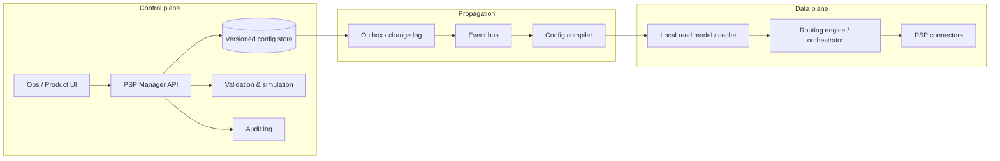

# Payment Service Provider Manager Market Landscape and Design Implications

## Executive summary

The market does not usually use the exact phrase “PSP Manager,” but the closest products converge on the same concept: a **payments control plane** for managing provider integrations, routing rules, retries, payment-method exposure, credentials, and operational visibility without redeploying code. The most representative payment-native platforms are from urlPrimerturn32search0, urlGr4vyturn31search3, urlIXOPAYturn22search6, urlYunoturn22search1, urlBR-DGEturn22search7, urlSpreedlyturn0search16, and open-source urlHyperswitchturn33search0. For architectural discipline, the clearest public analogs are explicit API-gateway control planes such as urlKong Inc.turn33search6’s Kong Gateway and urlApache APISIXturn33search3. citeturn23view3turn23view6turn23view8turn23view12turn23view16turn23view0turn17search1turn25view0turn26view0

The strongest architectural consensus is this: **keep control-plane writes off the transaction hot path**. Public vendor docs consistently show routing/workflow/integration setup being authored ahead of time and then executed by runtime routing engines, not fetched synchronously from an admin service on every payment. Kong and APISIX document this separation explicitly, including cached runtime config and continued traffic handling when control-plane connectivity is lost; payment vendors expose the same operational intent through pre-published workflows, routes, and environment promotions. citeturn25view0turn25view1turn25view2turn26view0turn23view3turn35view0turn23view16turn12search21turn20search0

Across public documentation, the market is strongest on **routing rules, connector abstraction, webhook normalization/security, sandbox-vs-prod separation, observability, and RBAC**. It is materially weaker—at least in public docs—on **documented transactional outbox mechanics, immutable config snapshots per transaction, and maker-checker approval flows for production config changes**. Those are the highest-value areas where a purpose-built PSP Manager can exceed today’s norm. citeturn23view4turn23view9turn23view15turn10search1turn29view4turn27view4turn25view4turn20search3turn21search0turn21search2

The recommended direction for your PSP Manager is to build it as a **versioned control plane** with: compiled runtime read models, event-driven propagation, local caches in the routing/orchestration layer, externalized secrets, rollbackable releases, per-transaction applied-config references, and explicit approval gates for production. That combination best matches current market practice where it is mature, and deliberately fills the most important gaps where public products remain thin. citeturn25view1turn25view2turn20search3turn11search24turn20search9turn21search0turn21search2

## Representative solutions

The table below mixes **payment-native orchestration products** with a small number of **control-plane analogs** that are highly relevant for PSP Manager design. “Deployment model” reflects what is documented publicly; where self-hosting or private-cloud modes are not described in primary docs, that is stated conservatively.

| Category | Product | Vendor | Short description | Primary audience | Deployment model | Official docs |
|---|---|---|---|---|---|---|
| Commercial | Unified Infrastructure + Workflows | urlPrimerturn32search0 | Visual payment automation, processor integrations, workflow validation, version export/import, and observability dashboards. Public docs show draft/published/archived workflow versions, sandbox→production promotion, and HMAC-signed webhooks. citeturn23view3turn23view4turn27view4turn23view5turn18search0turn29view5turn34view0 | Enterprise merchants and platforms | SaaS | urlDocsturn3search8 |
| Commercial | Payment orchestration platform | urlGr4vyturn31search3 | Payment orchestration with flow rules, intelligent routing, direct connector selection, and a dedicated single-tenant cloud model. Public docs show routing by country, metadata, payment source, SKUs, and percentage split. citeturn23view7turn23view6turn31search0turn31search13 | Enterprise merchants and platforms | Vendor-hosted cloud, single-tenant per customer | urlDocsturn0search10 |
| Commercial | IXOPAY Platform / Meta-Connector | urlIXOPAYturn22search6 | Enterprise payment orchestration with meta-connectors, routing/cascading/balancing/fallback, sandbox testing, roles, and audit-log capabilities. Public docs emphasize real-time condition-based routing and operational testing. citeturn23view8turn23view9turn23view10turn7search7turn19search11 | Enterprises, PSPs, platforms | Hosted cloud; public docs do not clearly document self-hosting | urlDocsturn22search2 |
| Commercial | Yuno dashboard, routing, checkout builder | urlYunoturn22search1 | Control layer for provider connections, routing, checkout configuration, monitors, insights, and secured webhooks. Public docs show account-level segmentation, teams/roles, and one-click sandbox/production switching. citeturn23view12turn23view13turn23view14turn23view15turn27view0turn27view1turn27view2 | Merchants and platforms | SaaS | urlDocsturn9search20 |
| Commercial | BR-DGE orchestration platform / smart routing | urlBR-DGEturn22search7 | Unified orchestration abstraction with rule sets, input/output fragments, volume split, priority-list fallback, portal configuration, and separate sandbox/production environments. citeturn23view16turn23view17turn10search1turn30view0 | Merchants, financial institutions, payment providers, platforms | Managed platform; public docs show sandbox and production portals, not self-hosting | urlDocsturn22search11 |
| Commercial | Spreedly platform / Composer | urlSpreedlyturn0search16 | Tokenization/vault plus gateway connectivity, workflow-based routing, retry/failover (“Recover”), RBAC, environment segmentation, and reporting. Spreedly explicitly documents that gateway creation is not part of transaction flow. citeturn23view0turn23view1turn29view0turn29view1turn29view2turn29view3turn23view2turn12search21 | Merchants, merchant aggregators, platforms | SaaS | urlDocsturn12search5 |
| Open source / open core | Hyperswitch | urlJuspayhttps://juspay.io | Open-source payments switch/orchestrator with connector abstraction, routing, retries, roles, analytics, and both hosted and self-hosted models. Public docs describe modular architecture and separate backend, Control Centre, and SDK deployment. citeturn33search0turn27view6turn28view7turn16search12turn1search0 | Merchant engineering teams, SaaS platforms, fintech infrastructure teams | SaaS and self-hosted | urlDocsturn17search1 |
| Open source | Kill Bill payments platform | urlKill Billturn33search5 | Open-source billing and payments platform with payment plugins, per-tenant plugin configuration, payment-control plugins for routing/retries, built-in audit/history, RBAC, and multi-tenancy. citeturn28view2turn28view1turn27view11turn27view12turn28view0 | Engineering-led SaaS, subscription, and fintech teams | Self-hosted | urlDocsturn13search13 |
| Control-plane analog | Kong Gateway | urlKong Inc.turn33search6 | Not payment-native, but one of the clearest public examples of explicit control plane / data plane separation, declarative configuration, drift detection, config delta sync, audit logs, and secret-vault integration. citeturn25view0turn25view1turn25view2turn25view3turn25view4turn25view5 | Platform engineering and API infrastructure teams | Self-managed and managed cloud variants | urlDocsturn14search10 |
| Control-plane analog | Apache APISIX | urlApache Software Foundationhttps://www.apache.org | Not payment-native, but highly relevant for decoupled CP/DP, standalone local config, Admin API control, and GitOps-style declarative management. citeturn26view0turn25view7turn25view8turn25view9 | Platform engineering and API infrastructure teams | Self-hosted | urlDocsturn33search7 |

## Architecture patterns in the market

A consistent pattern appears across both payment-native tools and explicit control-plane platforms: **author configuration once, execute it many times at runtime**. Kong documents this most explicitly: control-plane nodes manage config, data-plane nodes serve traffic, receive config over mTLS, load it into memory, and cache it locally so traffic can continue even when control-plane communication is interrupted. APISIX similarly supports decoupled and standalone modes, including local YAML/JSON configuration for the data plane. In payments, vendors expose the same practical shape: Primer requires workflows to exist before payments are processed; BR-DGE evaluates transactions against an existing rule set; Yuno configures routing in the dashboard before payment creation; Spreedly documents gateway setup as an administrative action rather than part of transaction flow. citeturn25view0turn25view1turn26view0turn23view3turn23view16turn35view0turn12search21

The market also converges on **versioned authoring and environment promotion**, but not always with equally mature semantics. Primer is the clearest payment-native example: workflows have draft/published/archived versions, export/import, and sandbox→production promotion. Yuno distinguishes published vs not-published routes and requires publish actions in routing and checkout. BR-DGE separates sandbox and production portals and API keys. IXOPAY and Spreedly both emphasize sandbox testing and environment separation. Hyperswitch documents distinct sandbox and production URLs and hosted vs self-hosted models. citeturn27view5turn23view4turn23view13turn27view0turn23view15turn10search1turn23view9turn29view4turn28view7

Where public docs are thinner is **how config changes propagate safely**. Kong explicitly documents immediate cluster-wide updates and optional incremental config sync that ships only changed entities; APISIX documents decoupled and standalone modes plus GitOps-oriented declarative tooling. Payment vendors rarely publish outbox internals, but they do expose runtime traces, retry flows, and normalized webhook/callback handling. For a PSP Manager, the practical implication is to maintain a clear split between the authoring store and the runtime read model, and to publish changes through an evented pipeline rather than having transaction processors query the authoring database directly. The transactional outbox pattern remains the strongest public primary-source precedent for making DB state changes and outbound config events reliable together. citeturn25view2turn25view9turn28view3turn19search15turn20search3turn20search7

On security and governance, market solutions consistently support **environment-scoped credentials, webhook signing, and at least basic role separation**. Yuno documents HMAC and OAuth2 webhook security; Primer documents environment-specific signing secrets; Hyperswitch documents webhook signatures and role-based team management; Spreedly, IXOPAY, BR-DGE, and Yuno all expose role/permission constructs. The stronger analog pattern from modern control planes goes further: Kong provides audit logs, signed audit records, and external secret backends; APISIX supports Vault and cloud secret managers; enterprise feature-flag tooling such as urlLaunchDarkly approvals docsturn21search2 shows environment-level approval gates as a mature control-plane pattern worth borrowing for production PSP changes. citeturn27view2turn27view3turn18search0turn16search2turn16search1turn29view2turn23view10turn23view14turn25view4turn25view5turn25view8turn21search0turn21search2

## Feature comparison

**Legend:** **Y** = clearly documented in public primary sources; **P** = partial, equivalent, or indirectly documented; **NP** = not publicly documented in the sources reviewed.  
The matrix focuses on products closest to the PSP Manager problem, plus Kong as a deliberate control-plane contrast.

### Runtime and configuration capabilities

| Product | Routing rules | Policy-as-code | Rule targeting | Versioning | Transactional outbox / event model | Config snapshot per transaction | Progressive rollout / canary | Connector templates / adapters | Notes |
|---|---|---|---|---|---|---|---|---|---|
| Primer | Y | P | Country, amount, currency, upstream outputs, processor logic | Y | P | P | Y | Y | Workflows, workflow versions, split utility, partner-side integration mapping editor, and workflow run history are publicly documented. citeturn23view3turn27view5turn3search1turn3search17turn29view5turn34view0 |
| Gr4vy | Y | P | Country, amount, metadata, payment source, SKUs, percentage split | NP | P | NP | Y | Y | Strong routing surface, but public docs are light on formal versioning and immutable per-transaction config references. citeturn23view6turn23view7turn4search3turn4search6 |
| IXOPAY | Y | P | Currency, amount, extra data, recurring, connector context | P | P | NP | Y | Y | Meta-connectors, balancing/fallback, and conditions are strong; public docs do not clearly expose workflow-style version history. citeturn23view8turn7search4turn23view11 |
| Yuno | Y | P | Country, amount, currency, metadata | P | Y | NP | P | Y | Published vs not-published routes and publish actions are documented; percentage canarying is not clearly documented in the reviewed sources. citeturn23view13turn27view0turn27view1turn35view0 |
| BR-DGE | Y | P | Monetary, BIN metadata, payment instrument, merchant metadata, payment rail, BIN | NP | P | NP | Y | Y | Rule fragments, rule sets, volume split, and processor priority list are well documented. citeturn30view0turn30view3turn30view4 |
| Spreedly | Y | P | Conditional dimensions in workflow UI; exact full targeting catalog not centralized in one public page | P | P | NP | P | Y | Strong on routing + retry/failover; weaker on public version semantics and explicit config snapshotting. citeturn29view0turn29view1turn23view1 |
| Hyperswitch | Y | P | Payment method, amount, currency, card network, customer country, volume percentages | P | Y | P | Y | Y | Strong payment-native open-source option; modular and self-hostable, but public docs are less explicit than Kong on config propagation internals. citeturn16search12turn17search1turn28view7turn1search0 |
| Kong Gateway | Y | Y | Route/service/consumer/plugin targeting rather than payment-specific business dimensions | Y | P | NP | NP | P | Included as an analog: strongest public pattern for declarative state, drift detection, diff/sync, and delta propagation. citeturn25view2turn25view3 |

### Governance and operations

| Product | Audit & compliance | RBAC / approval | Secret-vault integration | Health / operational status | Observability / metrics | Webhook mapping / normalization | Notes |
|---|---|---|---|---|---|---|---|
| Primer | P | NP | NP | Y | Y | Y | Strong operational visibility, validation, and signed webhooks; public sources reviewed did not surface admin audit logs or maker-checker approvals. citeturn23view5turn3search14turn27view4turn18search0turn28view3turn34view0 |
| Gr4vy | P | P | NP | P | P | Y | Good connector/webhook control and secure key handling; public docs are less explicit on enterprise governance primitives than some peers. citeturn5search0turn5search4turn5search9turn4search5 |
| IXOPAY | Y | P | NP | P | Y | Y | Audit-log export and provider-config change tracing are strong differentiators. citeturn7search7turn19search11turn23view10turn7search11turn19search15 |
| Yuno | P | P | NP | Y | Y | Y | Teams/roles, environment-specific permissions, insights, monitors, and secure webhooks are well documented. citeturn23view14turn9search14turn8search7turn27view1turn27view2turn27view3 |
| BR-DGE | P | P | NP | P | P | P | Portal roles and transaction/report visibility are public; deeper audit and secret-management internals are not. citeturn23view17turn10search2turn10search5 |
| Spreedly | P | P | NP | P | Y | Y | RBAC, reporting, gateway-specific guides, and webhook setup are public; signed audit pipelines are not prominent in docs. citeturn29view2turn23view2turn12search2turn12search9 |
| Hyperswitch | P | P | P | P | Y | Y | Roles, analytics, webhooks, and external vault concepts are visible; explicit control-plane audit logging is less prominent. citeturn16search12turn16search2turn16search5turn17search10turn17search11 |
| Kong Gateway | Y | P | Y | Y | P | NP | Analog benchmark for signed audit logs, CP/DP resilience, and secret backends. citeturn25view1turn25view4turn25view5turn14search16 |

**What the comparison says at a glance:** payment-native products are strongest on **routing, connector abstraction, targetable rule logic, and webhook handling**. The generic control-plane analogs are strongest on **declarative config, drift detection, CP/DP resilience, signed audit records, and secret-vault integration**. That is a useful blueprint for a PSP Manager: copy payment-native ergonomics, but adopt API-gateway-grade control-plane engineering. citeturn23view3turn23view16turn29view0turn25view1turn25view3turn25view4turn25view5

## Patterns, pitfalls, and design choices

The most common integration pattern is **single integration + many provider adapters**. Primer, Yuno, BR-DGE, Spreedly, Hyperswitch, and IXOPAY all abstract multiple providers behind one platform layer. Routing then becomes a rule problem, not an integration problem: choose processor by country, amount, payment method, BIN, metadata, or performance signal; optionally retry or fail over; normalize the result; and drive downstream systems by webhook/callback. This pattern is now table stakes. citeturn23view12turn23view13turn23view16turn23view0turn1search0turn23view8

The most common operational pitfall is **letting authoring semantics leak into runtime semantics**. Public docs repeatedly show separate publish or setup steps—published vs draft workflows, not-published vs published routes, sandbox vs production environments, portal-specific rule sets, environment-scoped connectors, and explicit test gateways. That is a signal that a PSP Manager should not expose “live mutable objects” directly to the runtime engine. Instead, it should publish immutable config bundles that the routing/orchestration layer consumes atomically. Without that, you get partial rollouts, race conditions, and hard-to-explain payment behavior. citeturn27view5turn23view13turn23view15turn10search1turn29view4turn28view7

A second pitfall is **weak forensic traceability**. Primer’s workflow run history is unusually explicit about step path, timings, input/output data, and decisions. Many other products expose rich transaction data but say less publicly about the exact control-plane version or rule snapshot that governed a payment. For your PSP Manager, that means storing an **applied_config_version** or **routing_snapshot_id** on every transaction and connector attempt should be a deliberate design requirement, not a later enhancement. It is one of the clearest ways to outperform the current public state of the market. citeturn34view0turn28view3

A third pitfall is **secrets management inside the app domain model**. Payment products necessarily handle a large number of PSP keys, webhook secrets, and signing credentials. The strongest public precedent from generic control planes is to externalize those secrets through vault backends and keep only references and policy in the control plane. Kong and APISIX both document this; modern secret platforms such as urlHashiCorp Vaultturn11search24 exist precisely to centralize lifecycle management, rotation, and auditability. Your PSP Manager should store secret references, scopes, and rotation state—not plaintext credentials. citeturn25view5turn25view8turn11search24

The recommended design choices for your PSP Manager are therefore straightforward:

- **Control plane only in the manager.** Author integrations, assignments, and rules in PSP Manager; execute them in routing/orchestration/connector services from local runtime caches. Do not synchronously call PSP Manager in the hot path. citeturn25view1turn23view3turn35view0turn23view16turn12search21
- **Version everything.** Every publish should create an immutable config release; runtime consumes release N, not mutable rows. Support rollback to N-1. Primer’s workflow version model is the closest payment-native public reference. citeturn27view5turn23view4
- **Propagate by events, not by reads.** Use a transactional outbox from the config store, then compile and distribute deltas to read models/caches. Kong incremental sync and the transactional outbox pattern are the strongest public precedents. citeturn25view2turn20search3
- **Compile rules for runtime.** Persist a business-friendly DSL or UI model, but compile it into deterministic runtime artifacts keyed by merchant/project/payment method/environment. This is the right way to preserve low latency while supporting rich authoring semantics. citeturn34view0turn25view3turn25view9
- **Use progressive delivery for payment config.** Percentage splits, sandboxes, dry runs, and monitors are already common in the market; formalize them into canary rollout, auto-disable, and rollback rules. citeturn3search17turn23view6turn30view3turn27view1turn16search12
- **Adopt stronger governance than the market average.** Add explicit approval workflow for production config releases, before/after diffs, signed audit records, and separation of duties. That is more mature than most payment-native public docs and aligns with proven control-plane practice. citeturn25view4turn21search0turn21search2
- **Instrument the whole chain with correlated telemetry.** Use a model like urlOpenTelemetryturn20search9 so traces, metrics, and logs all carry merchant, connector, route, and config version context. This is essential for low-latency diagnosis and safe automation. citeturn20search1turn20search5turn20search13

## MVP and mature roadmap

A pragmatic PSP Manager roadmap should not try to copy every orchestration product at once. The fastest durable path is to ship the **control-plane core** first, then layer safety and optimization.

| Priority | Scope | Why it belongs here |
|---|---|---|
| MVP | Integration registry for existing PSP connectors; credential references; merchant/project assignment; environment split (sandbox/prod); deterministic routing rules by merchant/country/currency/amount/payment method; publish/rollback of versioned releases; runtime cache/read model; connector health/status; normalized webhook mapping; admin audit trail; basic RBAC; validation before publish; core metrics and traces. citeturn23view12turn23view13turn27view4turn23view9turn29view0turn25view1turn25view4 | This is the minimal credible PSP Manager and aligns with the strongest common denominator across the market. |
| Next | Percentage rollout and canary; decline-code-aware retry/fallback; richer targeting with BIN/card-network/metadata; monitor-driven route disablement; secret-vault integration and rotation workflows; per-transaction routing snapshot ID; team-scoped RBAC and production approval gate. citeturn28view3turn30view0turn27view1turn25view5turn21search0turn21search2 | This is where you materially improve safety, reliability, and auditability beyond a basic orchestration UI. |
| Mature product | GitOps / policy-as-code for config; multi-region CP/DP propagation with delta sync; signed audit records; simulation/replay against historical payment traffic; automated anomaly-driven rerouting; reconciliation and cost observability; embeddable self-service controls for platform customers. citeturn25view2turn25view3turn25view4turn25view9turn23view5turn16search13 | This turns PSP Manager from an admin module into a resilient payment control platform. |

## Open questions and limitations

Several vendors do **not** publicly document the internals that matter most for a control-plane engineer: exact outbox implementation, immutable config snapshots per transaction, cache invalidation semantics, and maker-checker approval models. Where those details were not in primary sources, this report marked them as **NP** rather than inferring them.

The clearest public references for **control-plane rigor** came from API-gateway platforms rather than payment-native vendors. That does not make payment-native products weak; it means their public documentation is optimized for integrators and operations teams, not for exposing internal distributed-systems design.

For your PSP Manager, that is actually useful: it suggests a strong differentiation strategy. Build the UX and payment semantics that merchants expect from orchestration vendors, but engineer the internals with the stricter CP/DP, versioning, propagation, audit, and secret-management discipline seen in mature control-plane platforms.