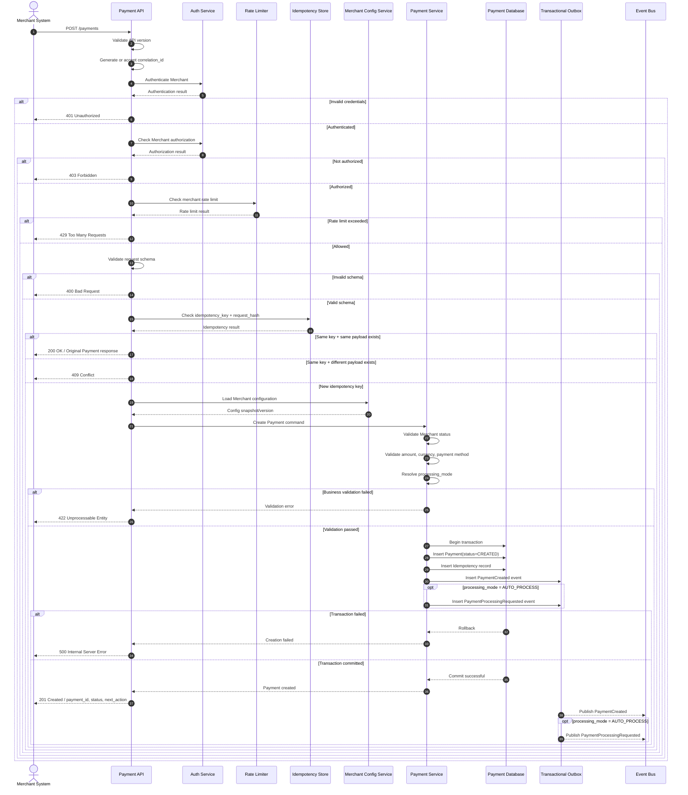

```mermaid
sequenceDiagram
    autonumber

    actor Merchant as Merchant System
    participant API as Payment API
    participant Auth as Auth Service
    participant RateLimiter as Rate Limiter
    participant Idem as Idempotency Store
    participant Config as Merchant Config Service
    participant PaymentSvc as Payment Service
    participant DB as Payment Database
    participant Outbox as Transactional Outbox
    participant EventBus as Event Bus

    Merchant->>API: POST /payments
    API->>API: Validate API version
    API->>API: Generate or accept correlation_id

    API->>Auth: Authenticate Merchant
    Auth-->>API: Authentication result

    alt Invalid credentials
        API-->>Merchant: 401 Unauthorized
    else Authenticated
        API->>Auth: Check Merchant authorization
        Auth-->>API: Authorization result

        alt Not authorized
            API-->>Merchant: 403 Forbidden
        else Authorized
            API->>RateLimiter: Check merchant rate limit
            RateLimiter-->>API: Rate limit result

            alt Rate limit exceeded
                API-->>Merchant: 429 Too Many Requests
            else Allowed
                API->>API: Validate request schema

                alt Invalid schema
                    API-->>Merchant: 400 Bad Request
                else Valid schema
                    API->>Idem: Check idempotency_key + request_hash
                    Idem-->>API: Idempotency result

                    alt Same key + same payload exists
                        API-->>Merchant: 200 OK / Original Payment response
                    else Same key + different payload exists
                        API-->>Merchant: 409 Conflict
                    else New idempotency key
                        API->>Config: Load Merchant configuration
                        Config-->>API: Config snapshot/version

                        API->>PaymentSvc: Create Payment command
                        PaymentSvc->>PaymentSvc: Validate Merchant status
                        PaymentSvc->>PaymentSvc: Validate amount, currency, payment method
                        PaymentSvc->>PaymentSvc: Resolve processing_mode

                        alt Business validation failed
                            PaymentSvc-->>API: Validation error
                            API-->>Merchant: 422 Unprocessable Entity
                        else Validation passed
                            PaymentSvc->>DB: Begin transaction
                            PaymentSvc->>DB: Insert Payment(status=CREATED)
                            PaymentSvc->>DB: Insert Idempotency record
                            PaymentSvc->>Outbox: Insert PaymentCreated event

                            opt processing_mode = AUTO_PROCESS
                                PaymentSvc->>Outbox: Insert PaymentProcessingRequested event
                            end

                            alt Transaction failed
                                DB-->>PaymentSvc: Rollback
                                PaymentSvc-->>API: Creation failed
                                API-->>Merchant: 500 Internal Server Error
                            else Transaction committed
                                DB-->>PaymentSvc: Commit successful
                                PaymentSvc-->>API: Payment created
                                API-->>Merchant: 201 Created / payment_id, status, next_action

                                Outbox-->>EventBus: Publish PaymentCreated
                                opt processing_mode = AUTO_PROCESS
                                    Outbox-->>EventBus: Publish PaymentProcessingRequested
                                end
                            end
                        end
                    end
                end
            end
        end
    end

```
