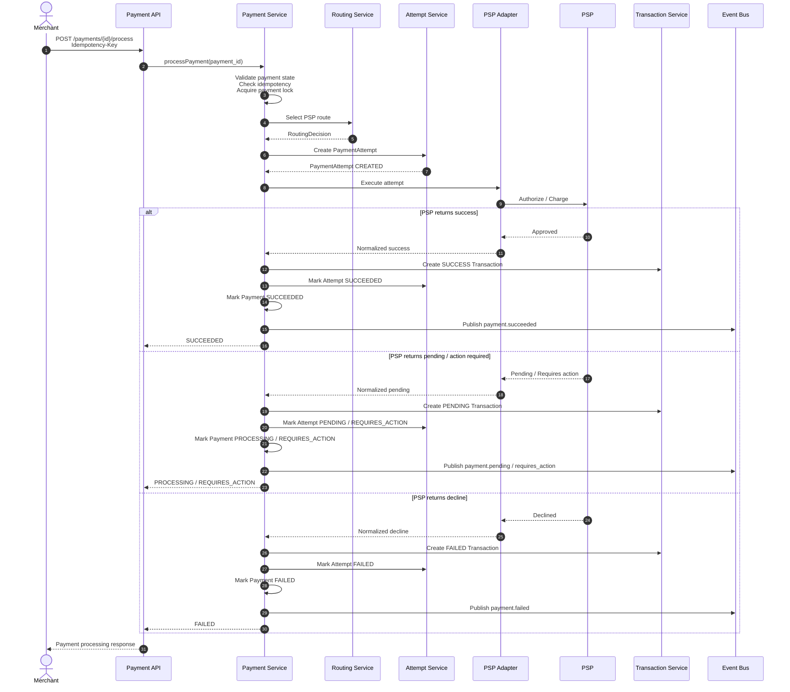

# UC-002: Payment Processing



## 1. Overview

Payment Processing is the core orchestration use case responsible for executing an existing `Payment` through a selected PSP.

This use case starts after a `Payment` has been created and is eligible for execution.

It covers:

- Payment Attempt creation
- Routing Decision execution
- PSP capability validation
- PSP authorization / charge request
- synchronous and asynchronous PSP responses
- Payment, Payment Attempt, Transaction state transitions
- event publication through Outbox
- tracing and correlation across internal services and external PSP calls

This use case does not create a new Payment. Payment creation is covered by `UC-001: create_payment`.

---

## 2. Goal

Execute a payment intent by creating a Payment Attempt, selecting the appropriate PSP route, submitting the payment request to PSP, and updating the platform state based on the PSP execution result.

The platform must guarantee that:

- one processing command does not create duplicate financial execution;
- each PSP execution attempt is represented by exactly one Payment Attempt;
- all external PSP results are persisted as append-only Transactions;
- Payment status is derived from Payment Attempt and Transaction outcomes;
- async PSP results can safely update the payment later.

---

## 3. Actors

| Actor               | Type     | Responsibility                                                  |
| ------------------- | -------- | --------------------------------------------------------------- |
| Merchant System     | External | Initiates payment processing or confirms manual payment         |
| Payment API         | Internal | Accepts processing request                                      |
| Payment Service     | Internal | Owns Payment lifecycle and orchestration command                |
| Attempt Service     | Internal | Creates and manages Payment Attempts                            |
| Routing Service     | Internal | Selects PSP route based on merchant config, rules, capabilities |
| PSP Adapter         | Internal | Normalizes PSP-specific API interaction                         |
| PSP                 | External | Executes payment authorization / charge                         |
| Transaction Service | Internal | Stores PSP-originated financial events                          |
| Event Bus           | Internal | Distributes domain events                                       |
| Outbox Publisher    | Internal | Publishes events after DB commit                                |

---

## 4. Preconditions

Payment Processing can start only if:

1. `Payment` exists.
2. `Payment.status` is one of:
   - `CREATED`
   - `PROCESSING_ELIGIBLE`
   - `REQUIRES_CONFIRMATION`
3. `Payment.amount`, `currency`, `merchant_id`, `payment_method`, and `processing_mode` are immutable.
4. Merchant account is active.
5. Payment method is enabled for merchant.
6. Payment method capability supports requested operation:
   - `AUTHORIZE`
   - `SALE`
   - `TOKENIZED_PAYMENT`
   - `3DS_REQUIRED`, if applicable
7. No active non-terminal Payment Attempt exists for the same Payment.
8. Payment is not in terminal state:
   - `SUCCEEDED`
   - `FAILED`
   - `CANCELLED`
   - `EXPIRED`

---

## 5. Trigger

Payment Processing can be triggered by:

| Trigger            | Description                                                 |
| ------------------ | ----------------------------------------------------------- |
| `AUTO_PROCESS`     | Processing starts automatically after Payment creation      |
| `MANUAL_CONFIRM`   | Merchant explicitly calls confirm/process endpoint          |
| Internal retry     | Platform retries eligible attempt according to retry policy |
| Failover flow      | Platform starts a new attempt after PSP/provider failure    |
| Async continuation | PSP webhook updates previously pending attempt              |

Primary API trigger:

```http
POST /payments/{payment_id}/process
```

Manual confirmation trigger:

```http
POST /payments/{payment_id}/confirm
```

---

## 6. Input Data

### 6.1 Request Parameters

| Field                    |    Required | Description                                                       |
| ------------------------ | ----------: | ----------------------------------------------------------------- |
| `payment_id`             |         Yes | Existing Payment identifier                                       |
| `merchant_id`            |         Yes | Merchant owning the Payment, resolved from authentication context |
| `idempotency_key`        |         Yes | Merchant-provided key for processing command deduplication        |
| `payment_method_details` | Conditional | Required if not already attached to Payment                       |
| `customer_ip`            | Conditional | Required for risk, 3DS, or PSP-specific requirements              |
| `user_agent`             | Conditional | Required for browser-based authentication flows                   |
| `return_url`             | Conditional | Required for redirect or 3DS flows                                |
| `metadata`               |          No | Merchant-defined key-value data                                   |

### 6.2 Internal Data Used

| Data                        | Source                        |
| --------------------------- | ----------------------------- |
| Payment                     | Payment Service               |
| Merchant configuration      | Merchant Service              |
| Payment method capabilities | Payment Method Registry       |
| Routing rules               | Rule Engine / Routing Service |
| PSP credentials             | PSP Configuration Store       |
| Retry / failover policy     | Business Rules                |
| Idempotency record          | Idempotency Store             |

---

## 7. Main Flow

### 7.1 Happy Path — Synchronous Success

1. Merchant sends payment processing request with `payment_id` and `Idempotency-Key`.
2. Payment API authenticates merchant.
3. Payment API validates request schema.
4. Payment Service loads Payment by `payment_id`.
5. Payment Service validates ownership: `payment.merchant_id == authenticated_merchant_id`.
6. Payment Service checks current Payment status.
7. Payment Service checks idempotency record for:
   - merchant ID;
   - payment ID;
   - operation type: `PAYMENT_PROCESSING`;
   - idempotency key.
8. If no idempotency record exists, Payment Service creates one with status `IN_PROGRESS`.
9. Payment Service acquires processing lock for the Payment.
10. Payment Service verifies no active non-terminal Attempt exists.
11. Payment Service requests route from Routing Service.
12. Routing Service evaluates:
    - merchant routing configuration;
    - PSP availability;
    - payment method capabilities;
    - currency support;
    - amount limits;
    - country restrictions;
    - risk and business policies.
13. Routing Service creates `RoutingDecision`.
14. Attempt Service creates `PaymentAttempt` with status `CREATED`.
15. Payment Service updates Payment status to `PROCESSING`.
16. Payment Service stores domain events in Outbox:
    - `payment.processing_started`;
    - `payment_attempt.created`;
    - `routing_decision.created`.
17. PSP Adapter builds PSP-specific request.
18. PSP Adapter sends authorization / charge request to PSP using PSP idempotency key.
19. PSP returns synchronous approval.
20. PSP Adapter normalizes PSP response.
21. Transaction Service creates append-only `Transaction`:
    - type: `AUTHORIZATION` or `SALE`;
    - status: `SUCCESS`;
    - source: `PSP_RESPONSE`.
22. Attempt Service updates Payment Attempt to `SUCCEEDED`.
23. Payment Service updates Payment to `SUCCEEDED`.
24. Payment Service marks idempotency record as `COMPLETED`.
25. Payment Service stores Outbox events:
    - `transaction.created`;
    - `payment_attempt.succeeded`;
    - `payment.succeeded`.
26. API returns successful response to Merchant.

---

## 8. Alternative Flows

### AF-001: PSP returns asynchronous / pending response

Condition:

- PSP accepts the payment but final result is not available immediately.

Flow:

1. PSP returns status:
   - `PENDING`;
   - `REQUIRES_ACTION`;
   - `REDIRECT_REQUIRED`;
   - `3DS_REQUIRED`.
2. PSP Adapter normalizes response.
3. Transaction Service creates Transaction with status `PENDING`.
4. Attempt Service updates Attempt to:
   - `PENDING`; or
   - `REQUIRES_ACTION`.
5. Payment Service updates Payment to:
   - `PROCESSING`; or
   - `REQUIRES_ACTION`.
6. Outbox stores:
   - `transaction.created`;
   - `payment_attempt.pending`;
   - `payment.requires_action`, if applicable.
7. API returns response with next action details.

Result:

- Payment remains non-terminal.
- Final status must be resolved by PSP webhook or status sync.

### AF-002: PSP hard decline

Condition:

- PSP returns final decline.

Flow:

1. PSP returns decline response.
2. PSP Adapter maps PSP decline code to platform decline category.
3. Transaction Service creates Transaction:
   - type: `AUTHORIZATION` or `SALE`;
   - status: `FAILED`;
   - decline code: normalized code.
4. Attempt Service updates Attempt to `FAILED`.
5. Payment Service updates Payment to `FAILED`.
6. Outbox stores:
   - `transaction.created`;
   - `payment_attempt.failed`;
   - `payment.failed`.
7. API returns failed payment response.

No failover is allowed when decline reason is customer/payment-method related, for example:

- insufficient funds;
- stolen card;
- expired card;
- do not honor;
- authentication failed.

### AF-003: PSP technical failure with failover allowed

Condition:

- PSP call fails due to technical or provider-side issue.

Examples:

- PSP timeout before request reached PSP boundary;
- PSP 5xx;
- connection refused;
- provider unavailable;
- malformed PSP response;
- PSP idempotency conflict with authoritative failed result.

Flow:

1. PSP Adapter classifies failure as technical.
2. Attempt Service marks current Attempt as `FAILED`.
3. Transaction Service creates technical failure Transaction if PSP interaction reached PSP boundary.
4. Routing Service evaluates failover policy.
5. If failover is allowed, new Routing Decision is created.
6. New Payment Attempt is created for the next PSP.
7. Payment remains `PROCESSING`.
8. Processing continues with the new PSP route.

Constraint:

- Failover must not execute if previous PSP result is unknown and may still be approved.

### AF-004: PSP response timeout with unknown execution result

Condition:

- Platform sent request to PSP but did not receive final response within timeout.

Flow:

1. PSP Adapter returns `UNKNOWN_RESULT`.
2. Attempt Service updates Attempt to `PENDING_UNKNOWN`.
3. Payment Service keeps Payment in `PROCESSING`.
4. Transaction Service records Transaction:
   - status: `PENDING`;
   - reason: `PSP_RESPONSE_TIMEOUT`.
5. Status Sync job is scheduled.
6. No immediate failover is executed.
7. API returns `PROCESSING` with `pending_reason = PSP_RESPONSE_TIMEOUT`.

Reason:

- PSP may have executed the payment successfully.
- Immediate failover could create duplicate charge.

### AF-005: Duplicate processing request

Condition:

- Merchant retries the same processing request with the same idempotency key.

Flow:

1. Payment Service finds existing idempotency record.
2. If record is `COMPLETED`, previous response is returned.
3. If record is `IN_PROGRESS`, API returns `409 PROCESSING_IN_PROGRESS`.
4. If record is `FAILED_RETRYABLE`, processing may be retried according to policy.

No new Payment Attempt is created.

### AF-006: Payment already succeeded

Condition:

- Merchant sends process request for already successful Payment.

Flow:

1. Payment Service loads Payment.
2. Payment status is `SUCCEEDED`.
3. API returns current Payment state.
4. No new Attempt is created.
5. No PSP call is made.

### AF-007: Active Attempt already exists

Condition:

- Payment has non-terminal Attempt:
  - `CREATED`;
  - `PROCESSING`;
  - `PENDING`;
  - `REQUIRES_ACTION`;
  - `PENDING_UNKNOWN`.

Flow:

1. Payment Service rejects creation of new Attempt.
2. API returns current Payment and Attempt state.
3. No Routing Decision is created.
4. No PSP call is made.

### AF-008: Routing cannot select PSP

Condition:

- No eligible PSP route exists.

Examples:

- unsupported currency;
- payment method disabled;
- PSP limits exceeded;
- merchant route inactive;
- all PSPs unavailable;
- required capability missing.

Flow:

1. Routing Service returns `NO_ROUTE_AVAILABLE`.
2. Payment Attempt is not created.
3. Payment remains `CREATED` or moves to `FAILED`, depending on processing mode and rule.
4. Outbox stores `payment.processing_failed`.
5. API returns `422 NO_ROUTE_AVAILABLE`.

### AF-009: PSP requires customer action

Condition:

- PSP requires redirect, 3DS challenge, wallet authorization, or app confirmation.

Flow:

1. PSP returns action-required response.
2. Transaction is created with status `PENDING`.
3. Attempt is updated to `REQUIRES_ACTION`.
4. Payment is updated to `REQUIRES_ACTION`.
5. API returns `next_action`.

Example response fields:

```json
{
  "payment_id": "pay_123",
  "status": "REQUIRES_ACTION",
  "next_action": {
    "type": "REDIRECT",
    "url": "https://psp.example.com/challenge/abc",
    "expires_at": "2026-05-04T10:15:00Z"
  }
}
```

---

## 9. Resulting State

### 9.1 Successful synchronous processing

| Entity             | State       |
| ------------------ | ----------- |
| Payment            | `SUCCEEDED` |
| Payment Attempt    | `SUCCEEDED` |
| Routing Decision   | `SELECTED`  |
| Transaction        | `SUCCESS`   |
| Idempotency Record | `COMPLETED` |

### 9.2 Async / pending processing

| Entity             | State                            |
| ------------------ | -------------------------------- |
| Payment            | `PROCESSING` / `REQUIRES_ACTION` |
| Payment Attempt    | `PENDING` / `REQUIRES_ACTION`    |
| Routing Decision   | `SELECTED`                       |
| Transaction        | `PENDING`                        |
| Idempotency Record | `COMPLETED` for initial command  |

### 9.3 Failed processing

| Entity             | State                  |
| ------------------ | ---------------------- |
| Payment            | `FAILED`               |
| Payment Attempt    | `FAILED`               |
| Routing Decision   | `SELECTED` or `FAILED` |
| Transaction        | `FAILED`               |
| Idempotency Record | `COMPLETED`            |

---

## 10. Business Rules

| Rule ID   | Rule                                                                                      |
| --------- | ----------------------------------------------------------------------------------------- |
| BR-PP-001 | A Payment can have multiple Attempts, but only one active non-terminal Attempt at a time. |
| BR-PP-002 | Every PSP execution must be represented by exactly one Payment Attempt.                   |
| BR-PP-003 | Every PSP response that crosses PSP boundary must be persisted as a Transaction.          |
| BR-PP-004 | Transactions are append-only and must never be updated or deleted.                        |
| BR-PP-005 | Payment status is derived from latest authoritative Attempt / Transaction outcome.        |
| BR-PP-006 | PSP is source of truth after execution request is sent.                                   |
| BR-PP-007 | Failover is forbidden when PSP result is unknown.                                         |
| BR-PP-008 | Failover is forbidden for customer/payment-method declines.                               |
| BR-PP-009 | Retry is allowed only for retryable technical failures.                                   |
| BR-PP-010 | PSP idempotency key must be unique per Payment Attempt.                                   |
| BR-PP-011 | Merchant idempotency key must be unique per merchant + payment + operation.               |
| BR-PP-012 | Payment amount and currency cannot change during processing.                              |
| BR-PP-013 | Routing Decision must be persisted before PSP call.                                       |
| BR-PP-014 | Payment Attempt must be persisted before PSP call.                                        |
| BR-PP-015 | Outbox events must be committed atomically with state changes.                            |

---

## 11. Merchant Configuration Impact

Merchant configuration affects processing through:

| Configuration           | Impact                                                     |
| ----------------------- | ---------------------------------------------------------- |
| Enabled PSPs            | Defines candidate PSPs for routing                         |
| Payment method settings | Filters eligible methods and capabilities                  |
| Currency settings       | Filters PSPs by supported currencies                       |
| Country restrictions    | Blocks unsupported customer or card countries              |
| Amount limits           | Blocks PSP routes outside min/max thresholds               |
| Routing strategy        | Defines priority, weight, cost, conversion, fallback order |
| Failover policy         | Defines whether next PSP can be tried                      |
| Retry policy            | Defines retryable errors and max attempts                  |
| 3DS policy              | Defines frictionless/challenge requirements                |
| Capture mode            | Defines `AUTHORIZE_ONLY` vs `SALE`                         |
| Webhook settings        | Defines merchant notification behavior                     |
| Risk settings           | May block or challenge payment before PSP execution        |

---

## 12. Idempotency

### 12.1 Merchant-facing idempotency

Scope:

```text
merchant_id + payment_id + operation_type + idempotency_key
```

Operation type:

```text
PAYMENT_PROCESSING
```

Rules:

1. Same key + same request payload returns the same result.
2. Same key + different payload returns `409 IDEMPOTENCY_PAYLOAD_MISMATCH`.
3. Duplicate request must not create a new Attempt.
4. Duplicate request must not call PSP again.
5. Idempotency record must store:
   - request hash;
   - response body;
   - response status code;
   - operation status;
   - created_at;
   - expires_at.

Recommended retention:

```text
Minimum: 24 hours
Recommended: 7 days
```

### 12.2 PSP-facing idempotency

Scope:

```text
payment_attempt_id
```

Recommended PSP idempotency key format:

```text
pop_attempt_{payment_attempt_id}
```

Rules:

1. Each Payment Attempt gets exactly one PSP idempotency key.
2. PSP idempotency key must not be reused across Attempts.
3. PSP idempotency key must be logged and traceable.
4. PSP idempotency conflict must be treated as unknown result unless PSP returns authoritative final status.

---

## 13. Consistency / Transaction Boundaries

### 13.1 DB Transaction before PSP call

The following must be committed before PSP request is sent:

- Idempotency record: `IN_PROGRESS`
- Routing Decision
- Payment Attempt: `CREATED`
- Payment status: `PROCESSING`
- Outbox events:
  - `payment.processing_started`
  - `payment_attempt.created`
  - `routing_decision.created`

Reason:

- If platform crashes after PSP call, system must know that an Attempt existed.
- PSP callbacks must be matched to an existing Attempt.

### 13.2 PSP call boundary

PSP call is outside DB transaction.

Reason:

- DB transactions must not remain open during external network calls.
- PSP latency must not lock payment rows.

### 13.3 DB Transaction after PSP response

After PSP response, platform must atomically commit:

- Transaction record
- Attempt status update
- Payment status update
- Idempotency response
- Outbox events

### 13.4 Locking

Processing lock scope:

```text
payment_id
```

Required behavior:

- only one processing flow can mutate Payment at a time;
- lock timeout must be finite;
- lock acquisition failure returns `409 PAYMENT_LOCKED`.

Recommended lock timeout:

```text
5 seconds
```

---

## 14. Events

### 14.1 Published Events

| Event                                | When                           |
| ------------------------------------ | ------------------------------ |
| `payment.processing_started`         | Payment enters processing      |
| `routing_decision.created`           | PSP route selected             |
| `payment_attempt.created`            | Attempt created                |
| `payment_attempt.processing_started` | PSP call starts                |
| `transaction.created`                | PSP result persisted           |
| `payment_attempt.succeeded`          | Attempt succeeds               |
| `payment_attempt.failed`             | Attempt fails                  |
| `payment_attempt.pending`            | Attempt waits for async result |
| `payment.requires_action`            | Customer action required       |
| `payment.succeeded`                  | Payment reaches success        |
| `payment.failed`                     | Payment reaches failure        |
| `payment.processing_unknown`         | PSP result unknown             |
| `payment.processing_failed`          | Processing cannot continue     |

### 14.2 Event Requirements

Each event must include:

```json
{
  "event_id": "evt_123",
  "event_type": "payment_attempt.created",
  "occurred_at": "2026-05-04T10:00:00Z",
  "payment_id": "pay_123",
  "payment_attempt_id": "pa_123",
  "merchant_id": "mer_123",
  "correlation_id": "corr_123",
  "causation_id": "cmd_123",
  "trace_id": "trace_123",
  "schema_version": "1.0"
}
```

---

## 15. Output Response

### 15.1 Success

```json
{
  "payment_id": "pay_123",
  "status": "SUCCEEDED",
  "amount": 10000,
  "currency": "EUR",
  "payment_attempt_id": "pa_123",
  "routing_decision_id": "rd_123",
  "psp": "adyen",
  "transaction_id": "txn_123",
  "created_at": "2026-05-04T10:00:00Z"
}
```

### 15.2 Processing / Pending

```json
{
  "payment_id": "pay_123",
  "status": "PROCESSING",
  "amount": 10000,
  "currency": "EUR",
  "payment_attempt_id": "pa_123",
  "routing_decision_id": "rd_123",
  "psp": "stripe",
  "pending_reason": "PSP_ASYNC_PROCESSING"
}
```

### 15.3 Requires Action

```json
{
  "payment_id": "pay_123",
  "status": "REQUIRES_ACTION",
  "payment_attempt_id": "pa_123",
  "next_action": {
    "type": "REDIRECT",
    "url": "https://psp.example.com/redirect/session_123",
    "expires_at": "2026-05-04T10:15:00Z"
  }
}
```

### 15.4 Failure

```json
{
  "payment_id": "pay_123",
  "status": "FAILED",
  "payment_attempt_id": "pa_123",
  "failure": {
    "code": "CARD_DECLINED",
    "category": "CUSTOMER_PAYMENT_METHOD",
    "retryable": false
  }
}
```

---

## 16. Correlation & Tracing

Every processing flow must propagate:

| Identifier            | Purpose                                             |
| --------------------- | --------------------------------------------------- |
| `correlation_id`      | Groups all operations for one business flow         |
| `causation_id`        | Identifies command/event that caused current action |
| `trace_id`            | Distributed tracing across services                 |
| `span_id`             | Individual operation span                           |
| `payment_id`          | Business entity                                     |
| `payment_attempt_id`  | PSP execution entity                                |
| `routing_decision_id` | Route decision entity                               |
| `psp_reference`       | PSP-side identifier                                 |
| `merchant_reference`  | Merchant-side identifier                            |

Required logs:

- payment processing command received;
- idempotency check result;
- processing lock acquired/rejected;
- routing decision result;
- payment attempt created;
- PSP request sent;
- PSP response received;
- transaction created;
- payment status changed;
- outbox event persisted;
- outbox event published.

Sensitive data must be masked:

- PAN;
- CVV;
- authentication tokens;
- customer personal data;
- PSP credentials.

---

## 17. Non-functional Requirements

| NFR ID     | Requirement                                                                                                       |
| ---------- | ----------------------------------------------------------------------------------------------------------------- |
| NFR-PP-001 | Payment processing API availability must be at least `99.95%` monthly.                                            |
| NFR-PP-002 | For synchronous PSP responses, p95 API latency must be `< 2.5s`, excluding PSP latency.                           |
| NFR-PP-003 | Internal routing decision p95 latency must be `< 100ms`.                                                          |
| NFR-PP-004 | Payment Attempt creation p95 latency must be `< 50ms`.                                                            |
| NFR-PP-005 | PSP Adapter connection timeout must be `<= 2s`.                                                                   |
| NFR-PP-006 | PSP Adapter total request timeout must be `<= 10s`.                                                               |
| NFR-PP-007 | Outbox event publication lag p95 must be `< 5s`.                                                                  |
| NFR-PP-008 | Duplicate processing request must not create duplicate PSP execution in `100%` of cases.                          |
| NFR-PP-009 | All PSP responses must be persisted as Transactions before Payment terminal status is returned.                   |
| NFR-PP-010 | Processing logs must be searchable by `payment_id`, `payment_attempt_id`, `correlation_id`, and `psp_reference`.  |
| NFR-PP-011 | Payment processing state changes must be auditable for `100%` of Payments.                                        |
| NFR-PP-012 | Metrics must be emitted for success rate, decline rate, PSP timeout rate, failover rate, and unknown result rate. |
| NFR-PP-013 | Platform must support at least `100 payment processing requests per second` for MVP load profile.                 |
| NFR-PP-014 | System must recover pending unknown PSP results within `15 minutes` p95 via status sync.                          |
| NFR-PP-015 | No sensitive payment data may be logged in plaintext.                                                             |

---

## 18. Acceptance Criteria

### AC-001: Successful processing

Given a valid Payment in `CREATED` state  
And merchant configuration has an eligible PSP route  
When merchant processes the Payment  
Then platform creates a Payment Attempt  
And creates a Routing Decision  
And sends request to PSP  
And stores successful Transaction  
And updates Payment Attempt to `SUCCEEDED`  
And updates Payment to `SUCCEEDED`  
And returns success response.

### AC-002: Duplicate processing request

Given a Payment processing request was completed  
When merchant sends the same request with the same idempotency key  
Then platform returns the original response  
And does not create a new Attempt  
And does not call PSP again.

### AC-003: PSP pending response

Given PSP returns pending result  
When platform receives PSP response  
Then Transaction is stored as `PENDING`  
And Attempt is updated to `PENDING`  
And Payment remains `PROCESSING`  
And API returns processing response.

### AC-004: PSP hard decline

Given PSP returns final customer decline  
When platform processes the response  
Then Transaction is stored as `FAILED`  
And Attempt is updated to `FAILED`  
And Payment is updated to `FAILED`  
And failover is not executed.

### AC-005: PSP timeout with unknown result

Given PSP request was sent  
And PSP response timeout occurs  
When platform handles timeout  
Then Attempt is updated to `PENDING_UNKNOWN`  
And Payment remains `PROCESSING`  
And failover is not executed  
And status sync is scheduled.

### AC-006: No route available

Given no PSP supports payment method, currency, and merchant configuration  
When processing starts  
Then platform does not create PSP execution  
And returns `NO_ROUTE_AVAILABLE`.

### AC-007: Active attempt exists

Given Payment already has active Attempt  
When merchant sends another processing request  
Then platform returns current processing state  
And does not create another Attempt.

---

## 19. Edge Cases

| Edge Case                                                     | Expected Behavior                                                                                |
| ------------------------------------------------------------- | ------------------------------------------------------------------------------------------------ |
| Merchant retries after network disconnect                     | Return idempotent result if completed; otherwise return in-progress state.                       |
| PSP approves payment but API response to merchant fails       | Webhook/status sync finalizes Payment; merchant can retrieve status.                             |
| PSP webhook arrives before API flow completes                 | Webhook is matched by `payment_attempt_id` or PSP reference; processing lock serializes updates. |
| PSP returns unknown status                                    | Attempt becomes `PENDING_UNKNOWN`; status sync required.                                         |
| PSP returns duplicate response                                | Create only one Transaction per unique PSP event/reference.                                      |
| PSP returns success after timeout                             | Payment becomes `SUCCEEDED`; no failover attempt must have been executed.                        |
| PSP returns decline after timeout                             | Payment becomes `FAILED` if no other successful attempt exists.                                  |
| Failover PSP succeeds after first PSP later succeeds          | Must be prevented by no-failover-on-unknown rule.                                                |
| Merchant sends different payload with same idempotency key    | Return `409 IDEMPOTENCY_PAYLOAD_MISMATCH`.                                                       |
| Payment already terminal                                      | Return current state; do not call PSP.                                                           |
| Routing rule changes during processing                        | Existing Routing Decision remains immutable.                                                     |
| PSP credentials disabled after route selected but before call | PSP Adapter fails before external call; route may be retried/failover if allowed.                |
| Outbox publish fails                                          | State remains committed; publisher retries until event is delivered.                             |
| Transaction creation fails after PSP success                  | Payment must not be marked successful until Transaction is persisted.                            |
| Lock timeout                                                  | Return `409 PAYMENT_LOCKED`.                                                                     |
| Invalid merchant ownership                                    | Return `404 PAYMENT_NOT_FOUND` or `403 FORBIDDEN` according to API policy.                       |

---

## 20. Design Decisions

| Decision                                                                         | Rationale                                                                                |
| -------------------------------------------------------------------------------- | ---------------------------------------------------------------------------------------- |
| Payment Attempt is created before PSP call                                       | Enables webhook matching and recovery after crash.                                       |
| Routing Decision is immutable                                                    | Preserves auditability and explains why PSP was selected.                                |
| PSP call is outside DB transaction                                               | Prevents long-running locks and database contention.                                     |
| PSP result creates append-only Transaction                                       | Provides ledger-ready financial event history.                                           |
| Payment terminal status requires Transaction persistence                         | Prevents state without financial evidence.                                               |
| Unknown PSP result blocks failover                                               | Prevents duplicate customer charge.                                                      |
| Merchant idempotency and PSP idempotency are separate                            | Merchant command deduplication and PSP execution deduplication solve different problems. |
| Outbox is mandatory                                                              | Prevents state/event inconsistency.                                                      |
| Payment is intent, Attempt is execution, Transaction is external financial event | Keeps domain model clean and scalable for reconciliation/ledger.                         |

---

## 21. Summary

Payment Processing is the central execution use case of the Payment Orchestration Platform.

It converts a Payment intent into one or more controlled execution attempts while preserving:

- idempotency;
- auditability;
- PSP source-of-truth semantics;
- append-only financial event history;
- safe async processing;
- failover without duplicate charges;
- production-grade observability.

This use case is the foundation for:

- `payment_with_3ds.md`
- `payment_retry.md`
- `payment_failover.md`
- `payment_timeout_handling.md`
- `webhook_processing.md`
- `payment_status_sync.md`
