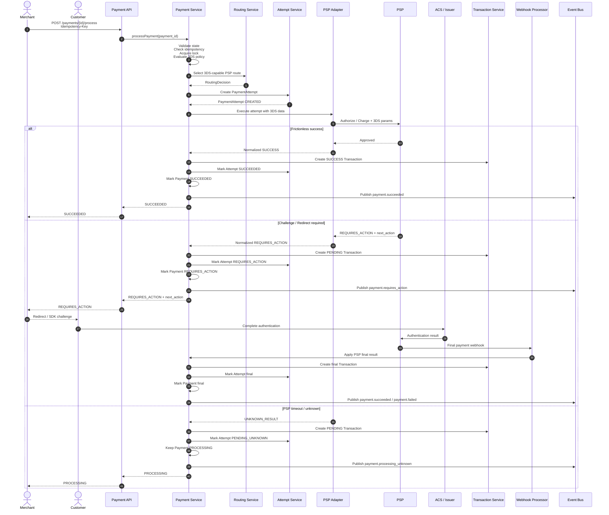

# UC-003: Payment Processing with 3DS



## 1. Overview

Payment Processing with 3DS is an extension of the standard Payment Processing use case where the customer must complete Strong Customer Authentication before the payment can reach a terminal result.

This use case covers the full orchestration lifecycle for authenticated card payments and other payment methods requiring customer challenge or redirect-based confirmation.

It includes:

- detection of 3DS requirement;
- merchant 3DS policy evaluation;
- PSP route selection with 3DS capability validation;
- Payment Attempt creation;
- PSP authentication / authorization initiation;
- handling of frictionless authentication;
- handling of challenge / redirect authentication;
- async completion through PSP webhook;
- fallback status synchronization when webhook is delayed or missing;
- transition from Payment → Payment Attempt → Transaction;
- correlation and traceability across redirect, PSP interaction, webhook, and final status update.

This use case starts when a Payment exists and is eligible for processing.

This use case does not cover Payment creation. Payment creation is covered by `UC-001: create_payment`.

Standard non-3DS processing is covered by `UC-002: payment_processing`.

---

## 2. Goal

Execute a payment that requires customer authentication while guaranteeing that the platform:

- creates exactly one Payment Attempt per PSP execution;
- does not create duplicate customer charges;
- persists every PSP-originated financial result as an append-only Transaction;
- supports asynchronous authentication completion;
- treats PSP as source of truth after execution starts;
- safely handles redirects, abandoned sessions, duplicate webhooks, delayed webhooks, and unknown PSP results;
- exposes a clear `next_action` response to the merchant when customer interaction is required.

---

## 3. Actors

| Actor                  | Type     | Responsibility                                                          |
| ---------------------- | -------- | ----------------------------------------------------------------------- |
| Merchant System        | External | Initiates payment processing and receives payment status                |
| Customer               | External | Completes authentication challenge or redirect flow                     |
| Customer Browser / App | External | Executes redirect, challenge, or SDK-based authentication               |
| Payment API            | Internal | Accepts payment processing request                                      |
| Payment Service        | Internal | Owns Payment lifecycle and orchestration command                        |
| Attempt Service        | Internal | Creates and manages Payment Attempts                                    |
| Routing Service        | Internal | Selects PSP route based on rules, capabilities, and merchant config     |
| Rule Engine            | Internal | Evaluates merchant policy, SCA/3DS rules, risk rules, and routing rules |
| PSP Adapter            | Internal | Normalizes PSP-specific 3DS and payment execution APIs                  |
| PSP                    | External | Executes authentication and payment authorization / charge              |
| ACS / Issuer           | External | Performs cardholder authentication challenge                            |
| Transaction Service    | Internal | Stores PSP-originated financial and authentication-related events       |
| Webhook Processor      | Internal | Processes async PSP notifications                                       |
| Status Sync Job        | Internal | Resolves delayed or missing PSP final status                            |
| Event Bus              | Internal | Distributes domain events                                               |
| Outbox Publisher       | Internal | Publishes events after DB commit                                        |

---

## 4. Preconditions

Payment Processing with 3DS can start only if:

1. `Payment` exists.
2. `Payment.status` is one of:
   - `CREATED`
   - `PROCESSING_ELIGIBLE`
   - `REQUIRES_CONFIRMATION`
3. `Payment` is not in terminal state:
   - `SUCCEEDED`
   - `FAILED`
   - `CANCELLED`
   - `EXPIRED`
4. `Payment.amount`, `currency`, `merchant_id`, `payment_method`, and `processing_mode` are immutable.
5. Merchant account is active.
6. Payment method is enabled for merchant.
7. Payment method supports the required operation:
   - `AUTHORIZE`
   - `SALE`
8. Payment method supports required authentication capability:
   - `3DS_SUPPORTED`, or
   - `3DS_REQUIRED`
9. Merchant 3DS policy is configured.
10. No active non-terminal Payment Attempt exists for the same Payment.
11. Required customer interaction fields are available when challenge or redirect can be required:
    - `return_url`
    - `browser_info`
    - `customer_ip`
    - `user_agent`
12. PSP route supports:
    - payment method;
    - currency;
    - country;
    - amount range;
    - 3DS flow;
    - capture mode;
    - merchant credentials.

---

## 5. Trigger

Payment Processing with 3DS can be triggered by:

| Trigger                  | Description                                                          |
| ------------------------ | -------------------------------------------------------------------- |
| `AUTO_PROCESS`           | Processing starts automatically after Payment creation               |
| `MANUAL_CONFIRM`         | Merchant explicitly confirms Payment                                 |
| Merchant process request | Merchant calls processing endpoint                                   |
| PSP webhook              | PSP sends final authentication / authorization result                |
| Status sync              | Platform polls PSP when webhook is delayed or final state is unknown |
| Expiration job           | Platform expires abandoned authentication sessions                   |

Primary API trigger:

```http
POST /payments/{payment_id}/process
```

Manual confirmation trigger:

```http
POST /payments/{payment_id}/confirm
```

Async webhook trigger:

```http
POST /webhooks/psp/{psp_code}
```

---

## 6. Input Data

### 6.1 Request Parameters

| Field                    |    Required | Description                                         |
| ------------------------ | ----------: | --------------------------------------------------- |
| `payment_id`             |         Yes | Existing Payment identifier                         |
| `merchant_id`            |         Yes | Merchant owning the Payment                         |
| `idempotency_key`        |         Yes | Merchant-provided key for processing command        |
| `payment_method_details` | Conditional | Required if not already attached to Payment         |
| `return_url`             |         Yes | URL where customer is returned after authentication |
| `browser_info`           | Conditional | Required for browser-based 3DS2 flows               |
| `customer_ip`            | Conditional | Required for SCA, risk, and PSP requirements        |
| `user_agent`             | Conditional | Required for browser-based authentication           |
| `device_channel`         | Conditional | Browser, app, or merchant-initiated channel         |
| `customer_email`         | Conditional | Required by some PSPs or risk policies              |
| `billing_address`        | Conditional | Required by some PSPs or risk policies              |
| `metadata`               |          No | Merchant-defined key-value data                     |

### 6.2 `browser_info` Fields

| Field                | Required | Description                   |
| -------------------- | -------: | ----------------------------- |
| `accept_header`      |      Yes | Browser Accept header         |
| `color_depth`        |      Yes | Browser color depth           |
| `java_enabled`       |      Yes | Whether Java is enabled       |
| `javascript_enabled` |      Yes | Whether JavaScript is enabled |
| `language`           |      Yes | Browser language              |
| `screen_height`      |      Yes | Screen height                 |
| `screen_width`       |      Yes | Screen width                  |
| `time_zone_offset`   |      Yes | Browser timezone offset       |
| `user_agent`         |      Yes | Browser user agent            |

### 6.3 Internal Data Used

| Data                        | Source                        |
| --------------------------- | ----------------------------- |
| Payment                     | Payment Service               |
| Merchant configuration      | Merchant Service              |
| Merchant 3DS policy         | Rule Engine / Merchant Config |
| Payment method capabilities | Payment Method Registry       |
| Routing rules               | Routing Service               |
| PSP capability matrix       | PSP Configuration Store       |
| PSP credentials             | PSP Configuration Store       |
| Risk decision               | Antifraud module, if enabled  |
| Retry / failover policy     | Business Rules                |
| Idempotency record          | Idempotency Store             |
| Existing attempts           | Attempt Service               |
| Existing transactions       | Transaction Service           |

---

## 7. Main Flow

### 7.1 Happy Path — 3DS Frictionless Success

1. Merchant sends payment processing request with `payment_id` and `Idempotency-Key`.
2. Payment API authenticates merchant.
3. Payment API validates request schema.
4. Payment Service loads Payment by `payment_id`.
5. Payment Service validates ownership: `payment.merchant_id == authenticated_merchant_id`.
6. Payment Service checks current Payment status.
7. Payment Service checks idempotency record for:
   - merchant ID;
   - payment ID;
   - operation type: `PAYMENT_PROCESSING`;
   - idempotency key.
8. If no idempotency record exists, Payment Service creates one with status `IN_PROGRESS`.
9. Payment Service acquires processing lock for the Payment.
10. Payment Service verifies no active non-terminal Payment Attempt exists.
11. Payment Service evaluates 3DS policy using:
    - merchant configuration;
    - payment method;
    - amount;
    - currency;
    - customer country;
    - card country;
    - risk decision;
    - regulatory requirements.
12. Payment Service requests route from Routing Service.
13. Routing Service evaluates:
    - merchant routing configuration;
    - PSP availability;
    - payment method capabilities;
    - 3DS support;
    - currency support;
    - amount limits;
    - country restrictions;
    - capture mode support;
    - risk/business policies.
14. Routing Service creates immutable `RoutingDecision`.
15. Attempt Service creates `PaymentAttempt` with status `CREATED`.
16. Payment Service updates Payment status to `PROCESSING`.
17. Payment Service stores domain events in Outbox:
    - `payment.processing_started`
    - `payment_attempt.created`
    - `routing_decision.created`
18. PSP Adapter builds PSP-specific authorization / charge request with 3DS parameters.
19. PSP Adapter sends request to PSP using PSP idempotency key.
20. PSP performs frictionless authentication and payment authorization.
21. PSP returns synchronous approval.
22. PSP Adapter normalizes PSP response.
23. Transaction Service creates append-only `Transaction`:
    - type: `AUTHORIZATION` or `SALE`
    - status: `SUCCESS`
    - authentication_result: `FRICTIONLESS_AUTHENTICATED`
    - source: `PSP_RESPONSE`
24. Attempt Service updates Payment Attempt to `SUCCEEDED`.
25. Payment Service updates Payment to `SUCCEEDED`.
26. Payment Service marks idempotency record as `COMPLETED`.
27. Payment Service stores Outbox events:
    - `transaction.created`
    - `payment_attempt.succeeded`
    - `payment.succeeded`
28. API returns successful response to Merchant.

---

### 7.2 Happy Path — 3DS Challenge / Redirect Required

1. Merchant sends payment processing request with required customer and browser context.
2. Payment Service validates Payment eligibility and idempotency.
3. Payment Service acquires processing lock.
4. Routing Service selects PSP route supporting 3DS.
5. Attempt Service creates Payment Attempt.
6. Payment Service updates Payment to `PROCESSING`.
7. PSP Adapter sends PSP request with 3DS parameters.
8. PSP determines that customer authentication challenge is required.
9. PSP returns:
   - `REQUIRES_ACTION`;
   - PSP session/reference;
   - redirect URL or challenge payload;
   - action expiry timestamp.
10. PSP Adapter normalizes response into platform `next_action`.
11. Transaction Service creates append-only `Transaction`:
    - type: `AUTHENTICATION`
    - status: `PENDING`
    - authentication_flow: `CHALLENGE` or `REDIRECT`
    - source: `PSP_RESPONSE`
12. Attempt Service updates Payment Attempt to `REQUIRES_ACTION`.
13. Payment Service updates Payment to `REQUIRES_ACTION`.
14. Payment Service stores authentication session data:
    - `payment_attempt_id`;
    - `psp_reference`;
    - `authentication_session_id`;
    - `next_action.type`;
    - `expires_at`;
    - `return_url`.
15. Payment Service marks idempotency record as `COMPLETED` for the initial command.
16. Payment Service stores Outbox events:
    - `transaction.created`
    - `payment_attempt.requires_action`
    - `payment.requires_action`
17. API returns `REQUIRES_ACTION` response to Merchant.
18. Merchant redirects Customer or invokes client-side authentication SDK.
19. Customer completes authentication with ACS / Issuer.
20. ACS returns result to PSP.
21. PSP completes authorization / charge or rejects the payment.
22. PSP sends webhook to platform.
23. Webhook Processor validates PSP webhook signature.
24. Webhook Processor resolves Payment Attempt by:
    - `payment_attempt_id`, if included;
    - `psp_reference`;
    - PSP session ID;
    - merchant reference fallback.
25. Webhook Processor acquires processing lock for Payment.
26. Transaction Service creates append-only final Transaction:
    - type: `AUTHORIZATION` or `SALE`
    - status: `SUCCESS` or `FAILED`
    - source: `PSP_WEBHOOK`
27. Attempt Service updates Payment Attempt to final status.
28. Payment Service updates Payment to final status.
29. Outbox stores final events:
    - `transaction.created`
    - `payment_attempt.succeeded` or `payment_attempt.failed`
    - `payment.succeeded` or `payment.failed`
30. Merchant webhook delivery is triggered separately by merchant webhook delivery flow.

---

## 8. Alternative Flows

### AF-001: 3DS authentication failed

Condition:

- Customer completes authentication, but issuer/ACS reports failure.

Flow:

1. PSP sends final failed webhook or returns failure during status sync.
2. Webhook Processor validates webhook.
3. Transaction Service creates Transaction:
   - type: `AUTHORIZATION` or `SALE`
   - status: `FAILED`
   - authentication_result: `AUTHENTICATION_FAILED`
   - source: `PSP_WEBHOOK`
4. Attempt Service updates Attempt to `FAILED`.
5. Payment Service updates Payment to `FAILED`.
6. Outbox stores:
   - `transaction.created`
   - `payment_attempt.failed`
   - `payment.failed`
7. Merchant is notified through merchant webhook delivery.

Failover rule:

- Failover is not allowed after authentication failure because failure is customer/authentication related.

---

### AF-002: Customer abandons 3DS challenge

Condition:

- Customer does not complete authentication before session expiry.

Flow:

1. Payment remains `REQUIRES_ACTION` until `authentication_expires_at`.
2. Expiration job identifies expired authentication session.
3. Status Sync checks PSP before expiring Payment.
4. If PSP has no successful final result:
   - Attempt is updated to `FAILED`.
   - Payment is updated to `FAILED`.
   - Transaction is created with:
     - type: `AUTHENTICATION`
     - status: `FAILED`
     - reason: `AUTHENTICATION_EXPIRED`
5. Outbox stores:
   - `transaction.created`
   - `payment_attempt.failed`
   - `payment.failed`

Recommended TTL:

```text
15 minutes
```

---

### AF-003: Customer returns to merchant before PSP webhook arrives

Condition:

- Customer completes authentication and is redirected to `return_url`, but platform has not yet received PSP webhook.

Flow:

1. Merchant receives customer redirect.
2. Merchant calls retrieve payment endpoint or displays pending state.
3. Payment remains:
   - `REQUIRES_ACTION`, or
   - `PROCESSING`
4. Platform waits for PSP webhook.
5. Status Sync may be triggered if webhook does not arrive within configured threshold.

Expected merchant-facing result:

```json
{
  "payment_id": "pay_123",
  "status": "PROCESSING",
  "pending_reason": "AWAITING_PSP_AUTHENTICATION_RESULT"
}
```

---

### AF-004: PSP webhook arrives before customer returns to merchant

Condition:

- PSP sends final webhook immediately after authentication completion.

Flow:

1. Webhook Processor validates and processes final PSP result.
2. Payment reaches terminal state.
3. Customer later returns to `return_url`.
4. Merchant retrieves current Payment status.
5. Platform returns terminal Payment state.

No state reversal is allowed unless later PSP event is more authoritative according to PSP status mapping rules.

---

### AF-005: Duplicate PSP webhook

Condition:

- PSP sends the same webhook more than once.

Flow:

1. Webhook Processor validates signature.
2. Platform checks webhook idempotency by:
   - PSP event ID;
   - PSP reference;
   - event type;
   - normalized transaction key.
3. If event was already processed:
   - no new Transaction is created;
   - no Payment state update is performed;
   - webhook returns success acknowledgment to PSP.
4. If event is new, normal webhook processing continues.

---

### AF-006: PSP timeout during initial 3DS setup

Condition:

- Platform sends initial PSP request, but PSP response times out before returning action data.

Flow:

1. PSP Adapter classifies result as `UNKNOWN_RESULT`.
2. Attempt Service updates Attempt to `PENDING_UNKNOWN`.
3. Payment Service keeps Payment in `PROCESSING`.
4. Transaction Service creates Transaction:
   - type: `AUTHENTICATION` or `AUTHORIZATION`
   - status: `PENDING`
   - reason: `PSP_RESPONSE_TIMEOUT`
5. Status Sync job is scheduled.
6. No failover is executed.
7. API returns `PROCESSING`.

Reason:

- PSP may have created an authentication or authorization session.
- Immediate failover may produce duplicate authentication or duplicate charge.

---

### AF-007: PSP cannot initialize 3DS session

Condition:

- PSP rejects the request before authentication session is created.

Examples:

- invalid merchant credentials;
- unsupported 3DS setup;
- invalid browser info;
- PSP validation error;
- unsupported card scheme for selected route.

Flow:

1. PSP Adapter normalizes PSP error.
2. If error is merchant/platform configuration issue:
   - Attempt is marked `FAILED`.
   - Payment is marked `FAILED` or remains processable based on policy.
3. If failover is allowed and PSP did not create execution/authentication session:
   - Routing Service selects another eligible PSP.
   - New Payment Attempt may be created.
4. If failover is not allowed:
   - Payment is marked `FAILED`.
5. Transaction is created only if PSP interaction crossed PSP boundary and produced a reference or event.

---

### AF-008: 3DS required but merchant did not provide return URL

Condition:

- Merchant request lacks required redirect/authentication context.

Flow:

1. Payment Service validates request.
2. Platform rejects processing before creating Attempt.
3. API returns:

```http
422 MISSING_AUTHENTICATION_CONTEXT
```

No PSP call is made.

---

### AF-009: 3DS policy requires challenge but PSP route supports only non-3DS

Condition:

- Merchant policy or regulation requires 3DS.
- Selected PSP/payment method route does not support 3DS.

Flow:

1. Routing Service excludes PSP route.
2. If no eligible PSP remains, Routing Service returns `NO_ROUTE_AVAILABLE`.
3. Payment Attempt is not created.
4. API returns `422 NO_3DS_CAPABLE_ROUTE_AVAILABLE`.

---

### AF-010: Exemption requested and accepted

Condition:

- Merchant or platform requests SCA exemption.
- PSP/issuer accepts exemption.

Flow:

1. PSP processes payment without challenge.
2. Transaction is created with:
   - status: `SUCCESS`
   - authentication_result: `EXEMPTION_ACCEPTED`
   - exemption_type, if provided.
3. Attempt is marked `SUCCEEDED`.
4. Payment is marked `SUCCEEDED`.

---

### AF-011: Exemption requested but rejected

Condition:

- PSP/issuer rejects exemption and requires authentication.

Flow:

1. PSP returns `REQUIRES_ACTION`.
2. Platform follows challenge/redirect flow.
3. Payment moves to `REQUIRES_ACTION`.

---

### AF-012: Final PSP status is unknown after challenge completion

Condition:

- Customer completes authentication, but PSP final authorization status is not available.

Flow:

1. PSP webhook or status sync returns non-final state.
2. Payment remains `PROCESSING`.
3. Attempt remains `PENDING` or `PENDING_UNKNOWN`.
4. Status Sync retries according to policy.
5. Merchant receives pending state until final result is resolved.

---

## 9. Resulting State

### 9.1 Frictionless success

| Entity                | State                        |
| --------------------- | ---------------------------- |
| Payment               | `SUCCEEDED`                  |
| Payment Attempt       | `SUCCEEDED`                  |
| Routing Decision      | `SELECTED`                   |
| Transaction           | `SUCCESS`                    |
| Authentication Result | `FRICTIONLESS_AUTHENTICATED` |
| Idempotency Record    | `COMPLETED`                  |

### 9.2 Challenge required

| Entity                 | State             |
| ---------------------- | ----------------- |
| Payment                | `REQUIRES_ACTION` |
| Payment Attempt        | `REQUIRES_ACTION` |
| Routing Decision       | `SELECTED`        |
| Transaction            | `PENDING`         |
| Authentication Session | `ACTIVE`          |
| Idempotency Record     | `COMPLETED`       |

### 9.3 Challenge completed successfully

| Entity                 | State       |
| ---------------------- | ----------- |
| Payment                | `SUCCEEDED` |
| Payment Attempt        | `SUCCEEDED` |
| Routing Decision       | `SELECTED`  |
| Transaction            | `SUCCESS`   |
| Authentication Session | `COMPLETED` |

### 9.4 Authentication failed

| Entity                 | State      |
| ---------------------- | ---------- |
| Payment                | `FAILED`   |
| Payment Attempt        | `FAILED`   |
| Routing Decision       | `SELECTED` |
| Transaction            | `FAILED`   |
| Authentication Session | `FAILED`   |

### 9.5 Authentication abandoned / expired

| Entity                 | State      |
| ---------------------- | ---------- |
| Payment                | `FAILED`   |
| Payment Attempt        | `FAILED`   |
| Routing Decision       | `SELECTED` |
| Transaction            | `FAILED`   |
| Authentication Session | `EXPIRED`  |

### 9.6 Unknown PSP result

| Entity           | State             |
| ---------------- | ----------------- |
| Payment          | `PROCESSING`      |
| Payment Attempt  | `PENDING_UNKNOWN` |
| Routing Decision | `SELECTED`        |
| Transaction      | `PENDING`         |
| Status Sync      | `SCHEDULED`       |

---

## 10. Business Rules

| Rule ID    | Rule                                                                                                           |
| ---------- | -------------------------------------------------------------------------------------------------------------- |
| BR-3DS-001 | 3DS-capable route must be selected when 3DS is required by merchant policy, regulation, PSP, or risk decision. |
| BR-3DS-002 | A Payment can have only one active non-terminal Payment Attempt at a time.                                     |
| BR-3DS-003 | A 3DS challenge must belong to exactly one Payment Attempt.                                                    |
| BR-3DS-004 | Payment Attempt must be created before PSP authentication request is sent.                                     |
| BR-3DS-005 | Routing Decision must be persisted before PSP authentication request is sent.                                  |
| BR-3DS-006 | Payment must move to `REQUIRES_ACTION` when customer interaction is required.                                  |
| BR-3DS-007 | Customer return URL must not be treated as source of truth for payment result.                                 |
| BR-3DS-008 | PSP webhook or PSP status sync is source of truth for final result.                                            |
| BR-3DS-009 | Transactions are append-only and must never be updated or deleted.                                             |
| BR-3DS-010 | Every final PSP authentication/authorization result must be persisted as Transaction.                          |
| BR-3DS-011 | Failover is forbidden while Payment is in `REQUIRES_ACTION`.                                                   |
| BR-3DS-012 | Failover is forbidden when PSP result is unknown.                                                              |
| BR-3DS-013 | Failover is forbidden after customer authentication failure.                                                   |
| BR-3DS-014 | Duplicate PSP webhooks must not create duplicate Transactions.                                                 |
| BR-3DS-015 | Authentication session must have finite expiration time.                                                       |
| BR-3DS-016 | Expired authentication must be verified with PSP before Payment is failed.                                     |
| BR-3DS-017 | Payment terminal status must not be returned until final Transaction is persisted.                             |
| BR-3DS-018 | PSP idempotency key must be unique per Payment Attempt.                                                        |
| BR-3DS-019 | Merchant idempotency key must be unique per merchant + payment + operation.                                    |
| BR-3DS-020 | Sensitive authentication payloads must not be logged in plaintext.                                             |

---

## 11. Merchant Configuration Impact

Merchant configuration affects 3DS processing through:

| Configuration           | Impact                                                                      |
| ----------------------- | --------------------------------------------------------------------------- |
| 3DS mode                | Defines whether 3DS is `DISABLED`, `OPTIONAL`, `FORCED`, or `RULE_BASED`    |
| SCA policy              | Defines when authentication is required                                     |
| Exemption policy        | Defines whether low-risk or low-value exemptions can be requested           |
| Challenge preference    | Defines whether challenge is preferred, avoided, or mandated                |
| Enabled PSPs            | Defines candidate PSP routes                                                |
| PSP 3DS support         | Filters PSPs that can execute authenticated flow                            |
| Payment method settings | Filters payment methods and capabilities                                    |
| Currency settings       | Filters PSPs by supported currencies                                        |
| Country restrictions    | Blocks unsupported customer/card countries                                  |
| Amount limits           | Blocks PSP routes outside min/max thresholds                                |
| Capture mode            | Defines `AUTHORIZE_ONLY` vs `SALE`                                          |
| Return URL settings     | Defines allowed redirect targets                                            |
| Webhook settings        | Defines merchant notification behavior                                      |
| Risk settings           | May force 3DS, allow exemption, or block payment                            |
| Retry policy            | Defines allowed retries for technical failures before authentication starts |
| Failover policy         | Defines whether failover can happen before 3DS session is created           |

---

## 12. Idempotency

### 12.1 Merchant-facing idempotency

Scope:

```text
merchant_id + payment_id + operation_type + idempotency_key
```

Operation type:

```text
PAYMENT_PROCESSING
```

Rules:

1. Same key + same request payload returns the same result.
2. Same key + different payload returns `409 IDEMPOTENCY_PAYLOAD_MISMATCH`.
3. Duplicate request must not create a new Payment Attempt.
4. Duplicate request must not create a new 3DS session.
5. Duplicate request must not call PSP again.
6. If original response was `REQUIRES_ACTION`, duplicate request returns the same `next_action` if still valid.
7. If `next_action` has expired, duplicate request returns current Payment state and does not restart authentication automatically.
8. Idempotency record must store:
   - request hash;
   - response body;
   - response status code;
   - operation status;
   - payment ID;
   - payment attempt ID;
   - routing decision ID;
   - authentication session ID, if created;
   - created_at;
   - expires_at.

Recommended retention:

```text
Minimum: 24 hours
Recommended: 7 days
```

### 12.2 PSP-facing idempotency

Scope:

```text
payment_attempt_id
```

Recommended PSP idempotency key format:

```text
pop_attempt_{payment_attempt_id}
```

Rules:

1. Each Payment Attempt gets exactly one PSP idempotency key.
2. PSP idempotency key must not be reused across Attempts.
3. PSP idempotency key must cover authentication/authorization initialization.
4. PSP idempotency key must be stored and traceable.
5. PSP idempotency conflict must be treated as unknown result unless PSP returns authoritative final status.

### 12.3 Webhook idempotency

Scope:

```text
psp_code + psp_event_id
```

Fallback scope if PSP event ID is unavailable:

```text
psp_code + psp_reference + event_type + normalized_status
```

Rules:

1. Duplicate webhook must be acknowledged with success.
2. Duplicate webhook must not create duplicate Transaction.
3. Duplicate webhook must not trigger duplicate merchant notification.
4. Webhook processing must be safe under concurrent delivery.

---

## 13. Consistency / Transaction Boundaries

### 13.1 DB Transaction before PSP call

The following must be committed before the PSP authentication/authorization request is sent:

- Idempotency record: `IN_PROGRESS`
- Routing Decision
- Payment Attempt: `CREATED`
- Payment status: `PROCESSING`
- Outbox events:
  - `payment.processing_started`
  - `payment_attempt.created`
  - `routing_decision.created`

Reason:

- PSP callback may arrive even if API flow crashes.
- Platform must be able to match webhook to an existing Attempt.
- Payment Attempt represents external execution boundary.

### 13.2 PSP call boundary

PSP call is outside DB transaction.

Reason:

- External network calls must not hold DB locks.
- PSP latency must not block Payment row.
- Platform must support recovery after crash.

### 13.3 DB Transaction after PSP requires action response

When PSP returns `REQUIRES_ACTION`, platform must atomically commit:

- Transaction record with `PENDING` status
- Authentication session data
- Attempt status: `REQUIRES_ACTION`
- Payment status: `REQUIRES_ACTION`
- Idempotency response
- Outbox events

### 13.4 DB Transaction after final PSP result

When final PSP result is received via webhook or status sync, platform must atomically commit:

- Final Transaction
- Attempt final status
- Payment final status
- Authentication session final status
- Outbox events

### 13.5 Locking

Processing lock scope:

```text
payment_id
```

Required behavior:

- only one command/webhook/status-sync process can mutate Payment state at a time;
- lock acquisition failure returns retryable conflict for API commands;
- webhook processing retries when lock is unavailable;
- lock timeout must be finite.

Recommended lock timeout:

```text
5 seconds
```

### 13.6 State precedence

If two sources report status for the same Payment Attempt:

| Source                         | Precedence |
| ------------------------------ | ---------- |
| PSP final webhook              | High       |
| PSP status sync final response | High       |
| Initial API response           | Medium     |
| Customer return URL            | Low        |
| Merchant client callback       | Low        |

Customer redirect must never finalize Payment by itself.

---

## 14. Events

### 14.1 Published Events

| Event                                | When                                     |
| ------------------------------------ | ---------------------------------------- |
| `payment.processing_started`         | Payment enters processing                |
| `routing_decision.created`           | PSP route selected                       |
| `payment_attempt.created`            | Attempt created                          |
| `payment_attempt.processing_started` | PSP request starts                       |
| `transaction.created`                | PSP response or webhook result persisted |
| `payment_attempt.requires_action`    | Customer authentication is required      |
| `payment.requires_action`            | Payment requires customer action         |
| `authentication_session.created`     | 3DS session created                      |
| `authentication_session.completed`   | Authentication completed successfully    |
| `authentication_session.failed`      | Authentication failed                    |
| `authentication_session.expired`     | Authentication session expired           |
| `payment_attempt.succeeded`          | Attempt succeeds                         |
| `payment_attempt.failed`             | Attempt fails                            |
| `payment_attempt.pending`            | Attempt waits for PSP result             |
| `payment.processing_unknown`         | PSP result unknown                       |
| `payment.succeeded`                  | Payment reaches success                  |
| `payment.failed`                     | Payment reaches failure                  |

### 14.2 Event Requirements

Each event must include:

```json
{
  "event_id": "evt_123",
  "event_type": "payment.requires_action",
  "occurred_at": "2026-05-04T10:00:00Z",
  "payment_id": "pay_123",
  "payment_attempt_id": "pa_123",
  "routing_decision_id": "rd_123",
  "authentication_session_id": "auths_123",
  "merchant_id": "mer_123",
  "correlation_id": "corr_123",
  "causation_id": "cmd_123",
  "trace_id": "trace_123",
  "schema_version": "1.0"
}
```

### 14.3 Event Publishing Rule

Events must be written to Outbox in the same DB transaction as the related state change.

Outbox Publisher must publish events asynchronously.

---

## 15. Output Response

### 15.1 Frictionless Success

```json
{
  "payment_id": "pay_123",
  "status": "SUCCEEDED",
  "amount": 10000,
  "currency": "EUR",
  "payment_attempt_id": "pa_123",
  "routing_decision_id": "rd_123",
  "psp": "adyen",
  "transaction_id": "txn_123",
  "authentication": {
    "required": true,
    "flow": "FRICTIONLESS",
    "result": "AUTHENTICATED"
  },
  "created_at": "2026-05-04T10:00:00Z"
}
```

### 15.2 Requires Action — Redirect

```json
{
  "payment_id": "pay_123",
  "status": "REQUIRES_ACTION",
  "amount": 10000,
  "currency": "EUR",
  "payment_attempt_id": "pa_123",
  "routing_decision_id": "rd_123",
  "psp": "stripe",
  "next_action": {
    "type": "REDIRECT",
    "url": "https://psp.example.com/3ds/session_123",
    "method": "GET",
    "expires_at": "2026-05-04T10:15:00Z"
  }
}
```

### 15.3 Requires Action — SDK / Challenge Payload

```json
{
  "payment_id": "pay_123",
  "status": "REQUIRES_ACTION",
  "payment_attempt_id": "pa_123",
  "next_action": {
    "type": "SDK_CHALLENGE",
    "sdk_payload": {
      "three_ds_server_trans_id": "3ds_srv_123",
      "acs_trans_id": "acs_123",
      "message_version": "2.2.0"
    },
    "expires_at": "2026-05-04T10:15:00Z"
  }
}
```

### 15.4 Processing / Unknown Result

```json
{
  "payment_id": "pay_123",
  "status": "PROCESSING",
  "payment_attempt_id": "pa_123",
  "pending_reason": "AWAITING_PSP_AUTHENTICATION_RESULT"
}
```

### 15.5 Authentication Failed

```json
{
  "payment_id": "pay_123",
  "status": "FAILED",
  "payment_attempt_id": "pa_123",
  "failure": {
    "code": "AUTHENTICATION_FAILED",
    "category": "CUSTOMER_AUTHENTICATION",
    "retryable": false
  }
}
```

---

## 16. Correlation & Tracing

Every 3DS processing flow must propagate:

| Identifier                  | Purpose                                             |
| --------------------------- | --------------------------------------------------- |
| `correlation_id`            | Groups all operations for one business flow         |
| `causation_id`              | Identifies command/event that caused current action |
| `trace_id`                  | Distributed tracing across services                 |
| `span_id`                   | Individual operation span                           |
| `payment_id`                | Business entity                                     |
| `payment_attempt_id`        | PSP execution entity                                |
| `routing_decision_id`       | Route decision entity                               |
| `authentication_session_id` | 3DS session entity                                  |
| `psp_reference`             | PSP-side identifier                                 |
| `psp_event_id`              | PSP webhook identifier                              |
| `merchant_reference`        | Merchant-side identifier                            |

Required logs:

- payment processing command received;
- idempotency check result;
- processing lock acquired/rejected;
- 3DS policy evaluation result;
- routing decision result;
- Payment Attempt created;
- PSP 3DS request sent;
- PSP 3DS response received;
- authentication session created;
- customer action required;
- PSP webhook received;
- PSP webhook signature validation result;
- webhook idempotency check result;
- Transaction created;
- Payment Attempt status changed;
- Payment status changed;
- outbox event persisted;
- outbox event published;
- status sync scheduled;
- authentication session expired.

Sensitive data must be masked:

- PAN;
- CVV;
- authentication tokens;
- customer personal data;
- ACS challenge payload if it contains sensitive fields;
- PSP credentials;
- browser fingerprint fields if classified as personal data.

---

## 17. Non-functional Requirements

| NFR ID      | Requirement                                                                                                                                                            |
| ----------- | ---------------------------------------------------------------------------------------------------------------------------------------------------------------------- |
| NFR-3DS-001 | Payment processing API availability must be at least `99.95%` monthly.                                                                                                 |
| NFR-3DS-002 | For frictionless synchronous PSP responses, p95 API latency must be `< 2.5s`, excluding PSP latency.                                                                   |
| NFR-3DS-003 | For `REQUIRES_ACTION` responses, p95 API latency must be `< 2.5s`, excluding PSP latency.                                                                              |
| NFR-3DS-004 | Internal 3DS policy evaluation p95 latency must be `< 100ms`.                                                                                                          |
| NFR-3DS-005 | Routing decision p95 latency must be `< 100ms`.                                                                                                                        |
| NFR-3DS-006 | Payment Attempt creation p95 latency must be `< 50ms`.                                                                                                                 |
| NFR-3DS-007 | PSP Adapter connection timeout must be `<= 2s`.                                                                                                                        |
| NFR-3DS-008 | PSP Adapter total request timeout must be `<= 10s`.                                                                                                                    |
| NFR-3DS-009 | Webhook signature validation p95 latency must be `< 100ms`.                                                                                                            |
| NFR-3DS-010 | Webhook processing p95 latency must be `< 2s`, excluding downstream merchant webhook delivery.                                                                         |
| NFR-3DS-011 | Outbox event publication lag p95 must be `< 5s`.                                                                                                                       |
| NFR-3DS-012 | Duplicate processing request must not create duplicate PSP execution in `100%` of cases.                                                                               |
| NFR-3DS-013 | Duplicate PSP webhook must not create duplicate Transaction in `100%` of cases.                                                                                        |
| NFR-3DS-014 | All final PSP results must be persisted as Transactions before Payment terminal status is exposed.                                                                     |
| NFR-3DS-015 | 3DS authentication sessions must have configurable TTL; default TTL must be `15 minutes`.                                                                              |
| NFR-3DS-016 | Expired 3DS sessions must be checked against PSP before Payment is failed.                                                                                             |
| NFR-3DS-017 | Status sync must resolve pending unknown PSP results within `15 minutes` p95.                                                                                          |
| NFR-3DS-018 | Processing logs must be searchable by `payment_id`, `payment_attempt_id`, `authentication_session_id`, `correlation_id`, and `psp_reference`.                          |
| NFR-3DS-019 | Payment processing state changes must be auditable for `100%` of Payments.                                                                                             |
| NFR-3DS-020 | Metrics must be emitted for 3DS required rate, frictionless rate, challenge rate, authentication failure rate, abandonment rate, timeout rate, and final success rate. |
| NFR-3DS-021 | Platform must support at least `100 payment processing requests per second` for MVP load profile.                                                                      |
| NFR-3DS-022 | Platform must support at least `300 PSP webhook events per second` for MVP load profile.                                                                               |
| NFR-3DS-023 | No sensitive payment or authentication data may be logged in plaintext.                                                                                                |

---

## 18. Acceptance Criteria

### AC-001: Frictionless 3DS success

Given a valid Payment in `CREATED` state  
And merchant 3DS policy requires or allows 3DS  
And selected PSP supports frictionless authentication  
When merchant processes the Payment  
Then platform creates Payment Attempt  
And creates Routing Decision  
And sends PSP request with 3DS data  
And stores successful Transaction  
And updates Payment Attempt to `SUCCEEDED`  
And updates Payment to `SUCCEEDED`  
And returns success response.

---

### AC-002: Challenge required

Given a valid Payment in `CREATED` state  
And PSP requires customer challenge  
When merchant processes the Payment  
Then platform creates Payment Attempt  
And creates pending authentication Transaction  
And updates Payment Attempt to `REQUIRES_ACTION`  
And updates Payment to `REQUIRES_ACTION`  
And returns `next_action` with expiration timestamp.

---

### AC-003: Customer completes challenge successfully

Given Payment is in `REQUIRES_ACTION`  
And Customer successfully completes authentication  
When PSP sends final success webhook  
Then platform validates webhook signature  
And creates final successful Transaction  
And updates Payment Attempt to `SUCCEEDED`  
And updates Payment to `SUCCEEDED`.

---

### AC-004: Customer fails authentication

Given Payment is in `REQUIRES_ACTION`  
When PSP sends authentication failed result  
Then platform creates failed Transaction  
And updates Payment Attempt to `FAILED`  
And updates Payment to `FAILED`  
And does not execute failover.

---

### AC-005: Customer abandons authentication

Given Payment is in `REQUIRES_ACTION`  
And authentication session expires  
When expiration job runs  
Then platform checks PSP final status  
And if no successful final status exists  
Then platform creates failed authentication Transaction  
And updates Payment Attempt to `FAILED`  
And updates Payment to `FAILED`.

---

### AC-006: Duplicate processing request

Given initial processing request returned `REQUIRES_ACTION`  
When merchant sends the same request with the same idempotency key  
Then platform returns the original `REQUIRES_ACTION` response  
And does not create a new Attempt  
And does not create a new 3DS session  
And does not call PSP again.

---

### AC-007: Duplicate webhook

Given PSP webhook was already processed  
When PSP sends the same webhook again  
Then platform acknowledges webhook  
And does not create duplicate Transaction  
And does not change Payment state again.

---

### AC-008: Missing authentication context

Given 3DS may be required  
And merchant request does not include required `return_url` or `browser_info`  
When processing starts  
Then platform rejects request before PSP call  
And returns `422 MISSING_AUTHENTICATION_CONTEXT`.

---

### AC-009: No 3DS-capable route

Given 3DS is required  
And no PSP route supports 3DS for payment method/currency/country  
When processing starts  
Then platform does not create Payment Attempt  
And returns `422 NO_3DS_CAPABLE_ROUTE_AVAILABLE`.

---

### AC-010: PSP timeout during 3DS initialization

Given PSP request was sent  
And PSP response timeout occurs  
When platform handles timeout  
Then Attempt is updated to `PENDING_UNKNOWN`  
And Payment remains `PROCESSING`  
And failover is not executed  
And status sync is scheduled.

---

## 19. Edge Cases

| Edge Case                                                         | Expected Behavior                                                                                                                          |
| ----------------------------------------------------------------- | ------------------------------------------------------------------------------------------------------------------------------------------ |
| Merchant retries after network disconnect                         | Return idempotent result if completed; otherwise return in-progress state.                                                                 |
| PSP creates 3DS session but API response to merchant fails        | Merchant retry returns same `next_action` through idempotency.                                                                             |
| Customer completes challenge but merchant never receives redirect | PSP webhook finalizes Payment; merchant can retrieve status.                                                                               |
| Customer returns before webhook arrives                           | Payment remains `PROCESSING` or `REQUIRES_ACTION`; merchant must poll/retrieve status.                                                     |
| Webhook arrives before customer return                            | Payment is finalized; customer return does not change state.                                                                               |
| Duplicate PSP webhook                                             | Webhook is acknowledged; no duplicate Transaction is created.                                                                              |
| PSP webhook lacks Payment Attempt ID                              | Resolve by PSP reference/session ID; if unresolved, store as unmatched webhook for investigation.                                          |
| PSP sends final success after platform expired authentication     | If PSP success is authoritative and no conflicting successful attempt exists, Payment may be corrected according to reconciliation policy. |
| PSP sends failed result after Payment already succeeded           | Ignore state downgrade; store event only if required by transaction/event policy.                                                          |
| PSP timeout after initial request                                 | Mark Attempt `PENDING_UNKNOWN`; do not failover.                                                                                           |
| PSP returns malformed challenge payload                           | Attempt fails if no usable action exists; failover only if PSP did not create execution/auth session.                                      |
| Browser info invalid                                              | Reject before PSP call if validation fails locally; otherwise map PSP validation error.                                                    |
| Return URL domain not allowed                                     | Reject request with `422 INVALID_RETURN_URL`.                                                                                              |
| Customer opens challenge URL multiple times                       | PSP/ACS controls session; platform state remains unchanged until PSP final result.                                                         |
| Customer completes challenge after TTL                            | Verify PSP final status; do not rely only on local TTL.                                                                                    |
| Merchant uses same idempotency key with different return URL      | Return `409 IDEMPOTENCY_PAYLOAD_MISMATCH`.                                                                                                 |
| Routing rules change during 3DS challenge                         | Existing Routing Decision remains immutable.                                                                                               |
| PSP credentials disabled after challenge started                  | Existing challenge continues; final webhook/status sync must still be processed if possible.                                               |
| Merchant disables payment method during challenge                 | Existing Payment Attempt continues; new attempts are blocked.                                                                              |
| Outbox publish fails                                              | State remains committed; publisher retries until event is delivered.                                                                       |
| Transaction creation fails after PSP final success                | Payment must not be marked `SUCCEEDED` until Transaction is persisted.                                                                     |
| Lock timeout during webhook processing                            | Webhook processing retries; PSP receives retryable response if acknowledgment cannot be safely returned.                                   |
| Status sync and webhook process same final result concurrently    | Payment lock and webhook idempotency prevent duplicate finalization.                                                                       |
| Customer authentication succeeds but authorization fails          | Transaction is `FAILED`; Payment is `FAILED`; reason category is authorization/payment-method failure.                                     |
| Exemption accepted                                                | Payment may succeed without challenge; authentication result records exemption.                                                            |
| Exemption rejected                                                | Flow continues as challenge/redirect required.                                                                                             |

---

## 20. Design Decisions

| Decision                                                               | Rationale                                                                            |
| ---------------------------------------------------------------------- | ------------------------------------------------------------------------------------ |
| 3DS is modeled as part of Payment Attempt lifecycle                    | Authentication is tied to a concrete PSP execution attempt.                          |
| Payment moves to `REQUIRES_ACTION` when customer interaction is needed | Merchant needs explicit state and action instructions.                               |
| Customer return URL is not source of truth                             | Redirect only confirms customer navigation, not final PSP result.                    |
| PSP webhook/status sync finalizes Payment                              | PSP is authoritative after execution starts.                                         |
| Authentication session is persisted                                    | Enables expiry handling, webhook matching, and auditability.                         |
| Routing Decision is persisted before PSP call                          | Explains why PSP was selected and supports audit/reconciliation.                     |
| Payment Attempt is persisted before PSP call                           | Enables webhook matching if platform crashes after PSP call.                         |
| PSP call is outside DB transaction                                     | Prevents DB lock contention during external network calls.                           |
| Transactions are append-only                                           | Maintains ledger-ready external event history.                                       |
| No failover while `REQUIRES_ACTION`                                    | Prevents duplicate authentication/charge and confusing customer experience.          |
| No failover on unknown PSP result                                      | Prevents duplicate charge.                                                           |
| Webhook idempotency is separate from merchant idempotency              | Merchant command deduplication and PSP event deduplication solve different problems. |
| Outbox is mandatory                                                    | Prevents state/event inconsistency.                                                  |
| Expiration requires PSP verification                                   | Avoids failing payments that completed externally but webhook was delayed.           |

---

## 21. Summary

Payment Processing with 3DS is the authenticated execution flow of the Payment Orchestration Platform.

It extends standard processing with customer authentication while preserving:

- idempotent merchant commands;
- PSP idempotency per Payment Attempt;
- webhook idempotency;
- immutable Routing Decisions;
- append-only Transactions;
- safe async finalization;
- strict transaction boundaries;
- no failover on unknown or in-progress authentication;
- measurable observability and operational controls.

This use case is the foundation for:

- `payment_timeout_handling.md`
- `webhook_processing.md`
- `payment_status_sync.md`
- `payment_failover.md`
- `payment_retry.md`
- `merchant_webhook_delivery.md`
