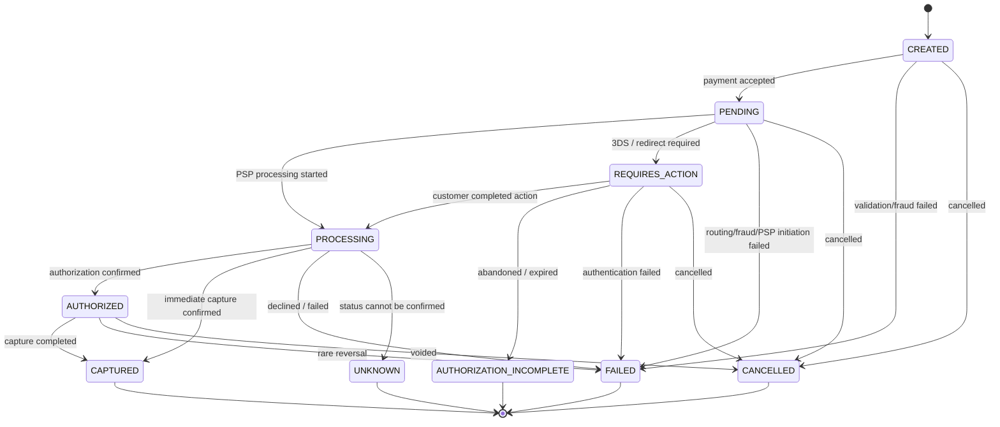

# Payment Status Model



## Payment Status Diagram


## 1. Overview

This document defines the payment lifecycle and all possible states of a Payment.

The status model is a core part of the system and ensures:

- consistent payment processing
- correct handling of asynchronous events
- predictable behavior across integrations

---

## 2. Design Principles

- **Explicit State Machine** — all states and transitions are predefined
- **Single Source of Truth** — status is stored in Payment
- **Deterministic Transitions** — no ambiguous state changes
- **Async-first** — system handles delayed and duplicated events
- **Webhook-driven truth** — final state is determined by PSP webhooks

---

## 3. Payment States

### 3.1 Initial States

| Status  | Description                              |
| ------- | ---------------------------------------- |
| CREATED | Payment is created but not yet processed |

---

### 3.2 Processing States

| Status          | Description                                                        |
| --------------- | ------------------------------------------------------------------ |
| PENDING         | Payment is accepted and waiting for processing (fraud/routing/PSP) |
| REQUIRES_ACTION | Additional user action required (e.g., 3DS, redirect)              |
| PROCESSING      | Payment is being processed by PSP                                  |

---

### 3.3 Intermediate States

| Status     | Description                             |
| ---------- | --------------------------------------- |
| AUTHORIZED | Funds are reserved but not yet captured |

---

### 3.4 Success States

| Status   | Description                                           |
| -------- | ----------------------------------------------------- |
| CAPTURED | Funds are successfully captured (final success state) |

---

### 3.5 Failure & Final States

| Status                   | Description                                                            |
| ------------------------ | ---------------------------------------------------------------------- |
| FAILED                   | Payment failed due to PSP decline, error, or validation                |
| CANCELLED                | Payment cancelled by user, merchant, or system                         |
| AUTHORIZATION_INCOMPLETE | User did not complete authorization flow (e.g., abandoned 3DS)         |
| UNKNOWN                  | Final state cannot be determined after timeout/polling/webhook failure |

---

## 4. State Transitions

### 4.1 Main Flow

```text
CREATED
  → PENDING
  → REQUIRES_ACTION (optional)
  → PROCESSING
  → AUTHORIZED
  → CAPTURED
```

### 4.2 Extended Flow

PENDING → PROCESSING
PENDING → REQUIRES_ACTION

REQUIRES_ACTION → PROCESSING
REQUIRES_ACTION → AUTHORIZATION_INCOMPLETE

PROCESSING → AUTHORIZED
PROCESSING → CAPTURED
PROCESSING → FAILED
PROCESSING → UNKNOWN

AUTHORIZED → CAPTURED
AUTHORIZED → FAILED
AUTHORIZED → CANCELLED

### 4.3 Failure Transitions

ANY STATE → FAILED
ANY STATE → CANCELLED

---

## 5. Transition Triggers

| Trigger           | Description                             |
| ----------------- | --------------------------------------- |
| API Request       | Payment created or updated              |
| PSP Response      | Immediate PSP response (not final)      |
| Webhook           | Async update from PSP (source of truth) |
| System Logic      | Antifraud or validation decision        |
| Timeout / Polling | System cannot confirm final state       |

---

## 6. Event-driven State Updates

Payment status must be updated based on webhook events from PSPs.

API responses are not considered final
Webhooks are the primary source of truth
System must handle duplicate and out-of-order events

---

## 7. Antifraud Impact

Antifraud may influence transitions:

CREATED → FAILED (blocked)
CREATED → PENDING (allowed)

---

## 8. Routing Impact

Routing determines which PSP is used during:

PENDING → PROCESSING

Routing does not change status directly but affects processing outcome.

---

## 9. Idempotency Rules

Repeated events must not change state incorrectly
Duplicate webhooks must be ignored
State transitions must be validated before applying

---

## 10. Invalid Transitions

Examples:

CAPTURED → PENDING
FAILED → PROCESSING
CANCELLED → AUTHORIZED

Such transitions must be rejected.

---

## 11. Final States

Final states are:

CAPTURED
FAILED
CANCELLED
AUTHORIZATION_INCOMPLETE
UNKNOWN

No transitions are allowed from final states.

---

## 12. Notes

Status is always derived from events
Payment lifecycle is asynchronous
External systems (PSPs) are considered unreliable
System must be resilient to missing or delayed updates
