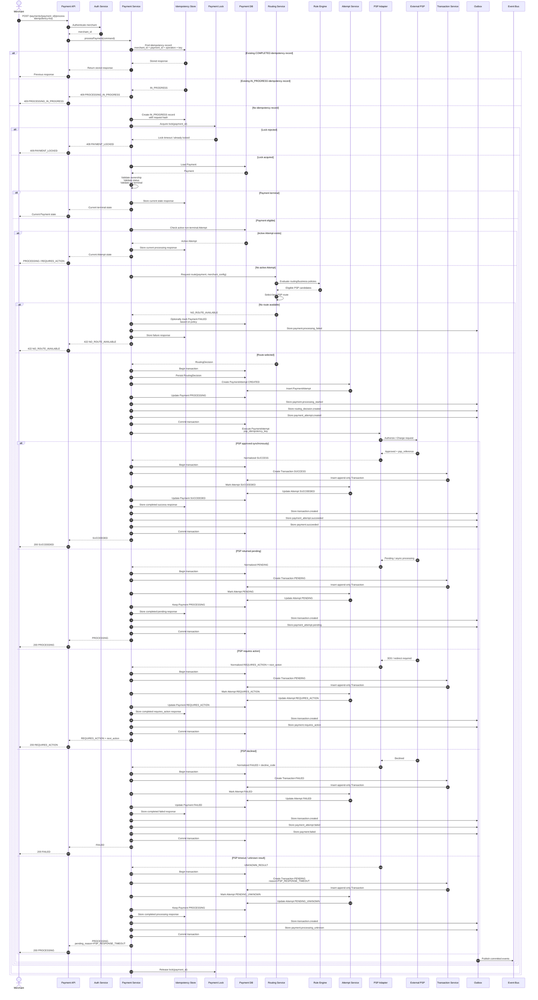

```mermaid
sequenceDiagram
    autonumber

    actor Merchant
    participant API as Payment API
    participant Auth as Auth Service
    participant PS as Payment Service
    participant IDS as Idempotency Store
    participant Lock as Payment Lock
    participant DB as Payment DB
    participant RS as Routing Service
    participant Rules as Rule Engine
    participant AS as Attempt Service
    participant PA as PSP Adapter
    participant PSP as External PSP
    participant TS as Transaction Service
    participant Outbox as Outbox
    participant Bus as Event Bus

    Merchant->>API: POST /payments/{payment_id}/process<br/>Idempotency-Key
    API->>Auth: Authenticate merchant
    Auth-->>API: merchant_id

    API->>PS: processPayment(command)

    PS->>IDS: Find idempotency record<br/>merchant_id + payment_id + operation + key

    alt Existing COMPLETED idempotency record
        IDS-->>PS: Stored response
        PS-->>API: Return stored response
        API-->>Merchant: Previous response
    else Existing IN_PROGRESS idempotency record
        IDS-->>PS: IN_PROGRESS
        PS-->>API: 409 PROCESSING_IN_PROGRESS
        API-->>Merchant: 409 PROCESSING_IN_PROGRESS
    else No idempotency record
        PS->>IDS: Create IN_PROGRESS record<br/>with request hash
        PS->>Lock: Acquire lock(payment_id)

        alt Lock rejected
            Lock-->>PS: Lock timeout / already locked
            PS-->>API: 409 PAYMENT_LOCKED
            API-->>Merchant: 409 PAYMENT_LOCKED
        else Lock acquired
            PS->>DB: Load Payment
            DB-->>PS: Payment

            PS->>PS: Validate ownership<br/>Validate status<br/>Validate not terminal

            alt Payment terminal
                PS->>IDS: Store current state response
                PS-->>API: Current terminal state
                API-->>Merchant: Current Payment state
            else Payment eligible
                PS->>DB: Check active non-terminal Attempt

                alt Active Attempt exists
                    DB-->>PS: Active Attempt
                    PS->>IDS: Store current processing response
                    PS-->>API: Current Attempt state
                    API-->>Merchant: PROCESSING / REQUIRES_ACTION
                else No active Attempt
                    PS->>RS: Request route(payment, merchant_config)
                    RS->>Rules: Evaluate routing/business policies
                    Rules-->>RS: Eligible PSP candidates
                    RS->>RS: Select best PSP route

                    alt No route available
                        RS-->>PS: NO_ROUTE_AVAILABLE
                        PS->>DB: Optionally mark Payment FAILED<br/>based on policy
                        PS->>Outbox: Store payment.processing_failed
                        PS->>IDS: Store failure response
                        PS-->>API: 422 NO_ROUTE_AVAILABLE
                        API-->>Merchant: 422 NO_ROUTE_AVAILABLE
                    else Route selected
                        RS-->>PS: RoutingDecision

                        PS->>DB: Begin transaction
                        PS->>DB: Persist RoutingDecision
                        PS->>AS: Create PaymentAttempt CREATED
                        AS->>DB: Insert PaymentAttempt
                        PS->>DB: Update Payment PROCESSING
                        PS->>Outbox: Store payment.processing_started
                        PS->>Outbox: Store routing_decision.created
                        PS->>Outbox: Store payment_attempt.created
                        PS->>DB: Commit transaction

                        PS->>PA: Execute PaymentAttempt<br/>psp_idempotency_key
                        PA->>PSP: Authorize / Charge request

                        alt PSP approved synchronously
                            PSP-->>PA: Approved + psp_reference
                            PA-->>PS: Normalized SUCCESS

                            PS->>DB: Begin transaction
                            PS->>TS: Create Transaction SUCCESS
                            TS->>DB: Insert append-only Transaction
                            PS->>AS: Mark Attempt SUCCEEDED
                            AS->>DB: Update Attempt SUCCEEDED
                            PS->>DB: Update Payment SUCCEEDED
                            PS->>IDS: Store completed success response
                            PS->>Outbox: Store transaction.created
                            PS->>Outbox: Store payment_attempt.succeeded
                            PS->>Outbox: Store payment.succeeded
                            PS->>DB: Commit transaction

                            PS-->>API: SUCCEEDED
                            API-->>Merchant: 200 SUCCEEDED

                        else PSP returned pending
                            PSP-->>PA: Pending / async processing
                            PA-->>PS: Normalized PENDING

                            PS->>DB: Begin transaction
                            PS->>TS: Create Transaction PENDING
                            TS->>DB: Insert append-only Transaction
                            PS->>AS: Mark Attempt PENDING
                            AS->>DB: Update Attempt PENDING
                            PS->>DB: Keep Payment PROCESSING
                            PS->>IDS: Store completed pending response
                            PS->>Outbox: Store transaction.created
                            PS->>Outbox: Store payment_attempt.pending
                            PS->>DB: Commit transaction

                            PS-->>API: PROCESSING
                            API-->>Merchant: 200 PROCESSING

                        else PSP requires action
                            PSP-->>PA: 3DS / redirect required
                            PA-->>PS: Normalized REQUIRES_ACTION + next_action

                            PS->>DB: Begin transaction
                            PS->>TS: Create Transaction PENDING
                            TS->>DB: Insert append-only Transaction
                            PS->>AS: Mark Attempt REQUIRES_ACTION
                            AS->>DB: Update Attempt REQUIRES_ACTION
                            PS->>DB: Update Payment REQUIRES_ACTION
                            PS->>IDS: Store completed requires_action response
                            PS->>Outbox: Store transaction.created
                            PS->>Outbox: Store payment.requires_action
                            PS->>DB: Commit transaction

                            PS-->>API: REQUIRES_ACTION + next_action
                            API-->>Merchant: 200 REQUIRES_ACTION

                        else PSP declined
                            PSP-->>PA: Declined
                            PA-->>PS: Normalized FAILED + decline_code

                            PS->>DB: Begin transaction
                            PS->>TS: Create Transaction FAILED
                            TS->>DB: Insert append-only Transaction
                            PS->>AS: Mark Attempt FAILED
                            AS->>DB: Update Attempt FAILED
                            PS->>DB: Update Payment FAILED
                            PS->>IDS: Store completed failed response
                            PS->>Outbox: Store transaction.created
                            PS->>Outbox: Store payment_attempt.failed
                            PS->>Outbox: Store payment.failed
                            PS->>DB: Commit transaction

                            PS-->>API: FAILED
                            API-->>Merchant: 200 FAILED

                        else PSP timeout / unknown result
                            PA-->>PS: UNKNOWN_RESULT

                            PS->>DB: Begin transaction
                            PS->>TS: Create Transaction PENDING<br/>reason=PSP_RESPONSE_TIMEOUT
                            TS->>DB: Insert append-only Transaction
                            PS->>AS: Mark Attempt PENDING_UNKNOWN
                            AS->>DB: Update Attempt PENDING_UNKNOWN
                            PS->>DB: Keep Payment PROCESSING
                            PS->>IDS: Store completed processing response
                            PS->>Outbox: Store transaction.created
                            PS->>Outbox: Store payment.processing_unknown
                            PS->>DB: Commit transaction

                            PS-->>API: PROCESSING<br/>pending_reason=PSP_RESPONSE_TIMEOUT
                            API-->>Merchant: 200 PROCESSING
                        end

                        Outbox->>Bus: Publish committed events
                    end
                end
            end

            PS->>Lock: Release lock(payment_id)
        end
    end

```
